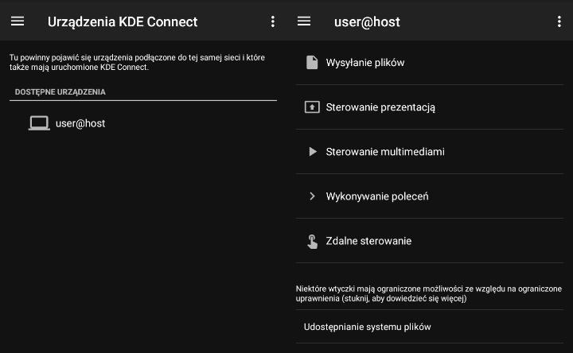
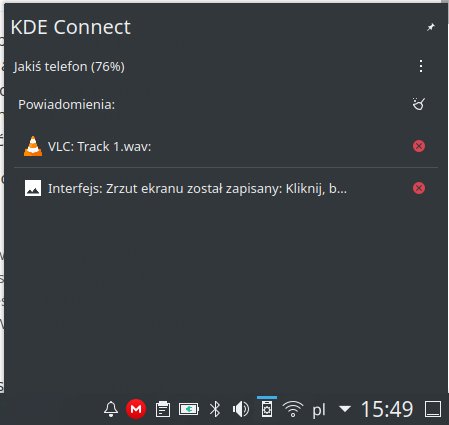
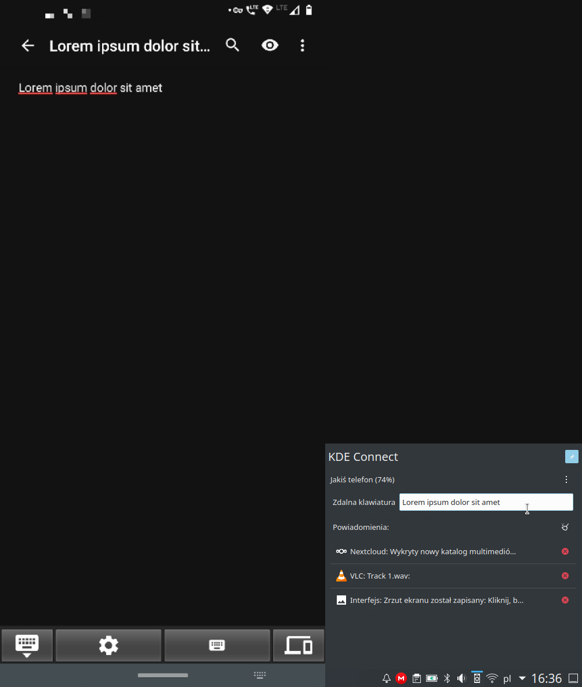
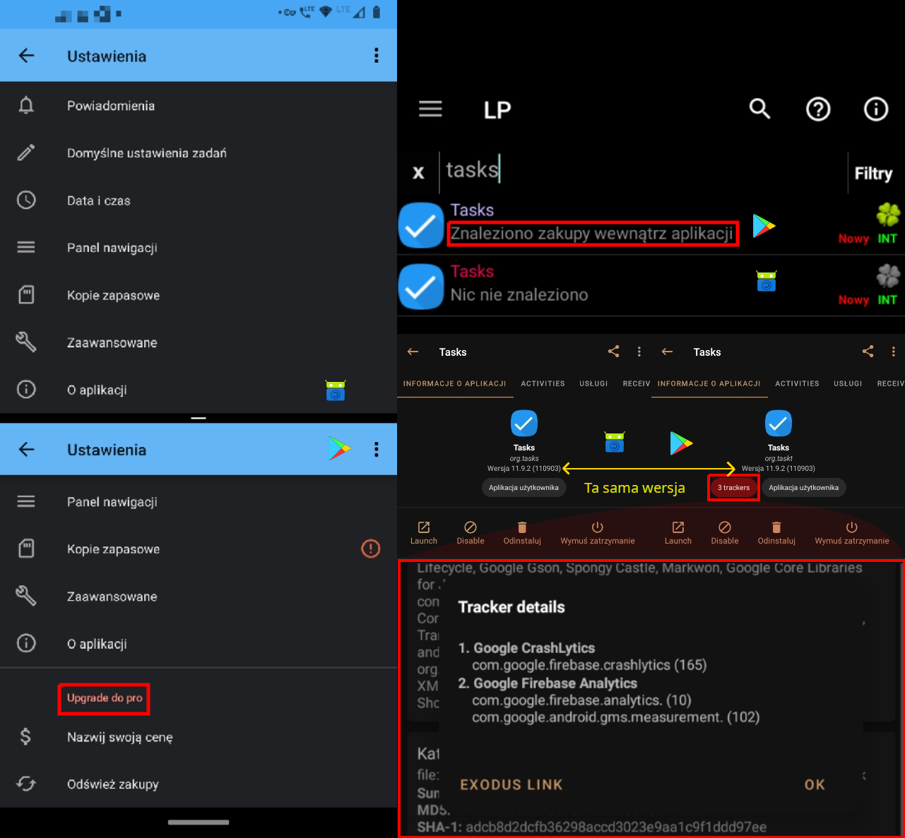

*Utworzony 9.04.2021*

# Integracja telefonu z komputerem

Telefon z komputerem najczęściej łączymy aby: bezproblemowo przesyłać dane między tymi dwoma urządzeniami, sterować komputerem przy użyciu telefonu jak pilotem, albo wyświetlać powiadomienia na dużym ekranie bez odrywania się od pracy. Istnieje wiele różnych programów do realizacji tego celu, a w dzisiejszym artykule przedstawię dwa z nich: KDE Connect, oraz AirDroid. Każdy ma swoje zalety i wady, oraz różni się oferowanym zestawem funkcjonalności.

## KDE Connect

Program dostarczony domyślnie wraz z środowiskiem KDE. Posiada zestaw przydatnych funkcji do obustronnej komunikacji, choć w mojej opinii wiele z nich jest niedopracowanych i może nie działać poprawnie na niektórych telefonach. Warto jednak wspomnieć, że jest aplikacją niekomercyjną i wydaną na licencji GNU GPL-v2, co oznacza że będzie szanować naszą wolność i prywatność.

Aplikację na Androida (*org.kde.kdeconnect_tp*) można pobrać [stąd](https://f-droid.org/packages/org.kde.kdeconnect_tp). Jest dostępna także w [Google Play](https://play.google.com/store/apps/details?id=org.kde.kdeconnect_tp), jednak rekomenduję pobieranie aplikacji z F-Droida jeżeli są dostępne[^1]. Do działania wymagane jest połączenie Wi-Fi. Gdy dwa urządzenia - komputer i telefon - znajdują się w tej samej sieci, mogą przesyłać między sobą dane. Po zainstalowaniu telefon musi się sparować z komputerem (jak Bluetooth). Jeżeli komputer jest dostępny, powinien wyświetlać się na stronie głównej, ale jeżeli tak się nie dzieje, spróbujcie dodać ręcznie jego adres IP.

Podczas parowania system zapyta o pozwolenie. Potem udzielamy wszelkich koniecznych uprawnień do działania aplikacji. Oto najbardziej przydatne (według mnie) funkcje KDE Connect:

### Wspólny schowek

Wyobraźmy sobie, że oglądamy film na YouTubie na komputerze i w pewnym momencie postanawiamy wysłać komuś do niego link. Może to być nieco problematyczne. Możemy próbować znaleźć ten film w aplikacji YouTube, wejść w historię (jeżeli korzystamy z konta Google), lub zeskanować kod QR i skopiować w telefonie jego zawartość. Używając KDE Connect wystarczy, że tylko skopiujemy link na komputerze, a następnie wkleimy go w telefonie. Działa to również w drugą stronę, z tym że zawartość schowka nie wyśle się automatycznie bo Android na to nie pozwala: trzeba kliknąć przycisk "Send clipboard" w powiadomieniu persistent.

### Automatyczne zatrzymanie filmu gdy ktoś dzwoni

Może nie jest to zamierzone zachowanie, ale jednak bardzo wygodne. Gdy ktoś dzwoni, system Android automatycznie zatrzymuje wszystkie odtwarzane w telefonie multimedia, jeżeli wyświetlają na pasku powiadomień sterowanie, oraz wznawia je po zakończeniu rozmowy. KDE Connect wyświetla takie powiadomienie gdy odtwarzany jest na komputerze film lub muzyka aby sterować odtwarzaniem jak pilotem. Każde zatrzymanie i wznowienie w powiadomieniu odpowiada zatrzymaniu i wznowieniu w komputerze. Android automatycznie zatrzymując odtwarzanie, "myśli" że zatrzymuje lokalne odtwarzanie, które tak naprawdę odbywa się na zdalnym urządzeniu.

### Wyświetlanie powiadomień na dużym ekranie

Czy wy też znacie tą sytuację, gdy wykonujecie na komputerze jakąś ważną pracę, a tu nagle: ping! - powiadomienie w telefonie. I chcąc-nie chcąc bierzecie telefon do ręki i sprawdzacie. Wasza uwaga właśnie uległa rozproszeniu. Na szczęście istnieje wiele aplikacji, które wyświetlą powiadomienie na ekranie komputera, dzięki czemu będziecie mogli szybko sprawdzić czy to coś ważnego, nie odrywając wzroku od ekranu. KDE Connect również posiada tę funkcję. Powiadomienia z telefonu mają swoje oddzielne miejsce w interfejsie KDE, nie mieszają się z powiadomieniami GNU/Linuxa.

Niestety funkcja ta jest nieco niedopracowana, ale w aktualizacjach zaobserwowałem drobne zmiany, na przykład czyszczenie powiadomień zaczęło powodować nie tylko usuwanie ich z interfejsu KDE, ale także z telefonu. Czasami gdy urządzenie się na jakiś czas rozłączy, a potem połączy ponownie, na ekranie pojawia się mnóstwo nowych powiadomień, nawet tych które zostały już usunięte.

### Zdalna klawiatura

Niekiedy pisanie na klawiaturze telefonu potrafi doprowadzić do szału. Albo autokorekta wariuje wpisując słowa których zazwyczaj nie używacie albo musicie stukać po jednej literce. Jeżeli korzystacie z KDE Connect, możecie albo napisać sobie tekst na komputerze, a potem go [skopiować](#wspólny-schowek), albo użyć klawiatury swojego komputera do pisania bezpośrednio w aplikacji. Aby to zrobić, przełączcie wirtualną klawiaturę na KDE Connect, a następnie otwórzcie panel pokazany powyżej. Zacznijcie pisać w polu które się pojawi, a każde naciśnięcie klawisza zostanie wysłane do telefonu i odtworzone. Mega fajny pomysł, ale również mógłby zostać trochę ulepszony, tak jak powiadomienia.

Po pierwsze, wpisywane znaki nie powinny być widoczne w polu, bo możemy wpisywać np. hasła. Zamiast tego mogłaby się tylko wyświetlać informacja, że zdalna klawiatura jest aktywna (jakiś krótki napis lub ikona), a samo uruchomienie zdalnej klawiatury mogło by zostać uproszczone aby wymagało mniejszej liczby kliknięć. Provider klawiatury mógłby zostać zastąpiony przez usługę ułatwień dostępu, co zredukowałoby konieczność przełączania domyślnej klawiatury na KDE Connect, albo klawiatura KDE Connect mogłaby również wyświetlać klawisze na ekranie gdy zdalna klawiatura nie jest aktywna, oraz aktywować się natychmiast gdy tylko otwarty zostanie panel.

### Wykonywanie komend

W ustawieniach KDE Connect na komputerze możemy dodać komendy które będzie można wywołać naciśnięciem przycisku, np. wyłączenie komputera, wykonanie jakiegoś skryptu bash, odblokowanie ekranu bez hasła, etc. Komendy zostaną wywołane jako login shell, podobnie jak komendy wpisywane w Krunner (przydaje się gdy interfejs padł żeby go uruchomić ponownie: `killall plasmashell ; plasmashell`).

**To nie koniec artykułu. Mam zamiar jeszcze napisać o aplikacji AirDroid.**

---

[^1]: Niektórzy developerzy wydają aplikacje na podwójnej licencji: komercyjnej i wolnej, a wersja dostępna w Google Play została skompilowana z innego źródła. Przykładem takiej aplikacji jest [org.tasks](https://github.com/tasks/tasks). Kod źródłowy dostępny na Githubie jest tym "właściwym" z którego F-Droid skompilował apk, ale ta sama aplikacja w tej samej wersji w Google Play (do której link developerzy zamieścili w README) zawiera złośliwy kod z trackerami Google Analytics i płatnościami za rzeczy które w rzeczywistości są (i powinny być) darmowe. Wersja F-Droid ma tylko opcję wsparcia twórcy za które nie otrzymujemy nic w zamian.   Nawet gdybym wspierał programistów finansowo, to nigdy nie chciałbym aby taki oszust zarobił na swojej aplikacji choćby 10 z. Ale jeżeli wy chcecie go wesprzeć - za darmo lub z marną nagrodą odblokowania pewnych funkcji w wersji komercyjnej, tu jest jego strona wsparcia: [https://tasks.org/docs/donate](https://tasks.org/docs/donate). Dodam, że zarówno aplikacja w Google Play, jak i F-Droid są regularnie aktualizowane, a poniższe screenshoty dotyczą wersji 11.9.2.    Stąd wniosek, że Google Play nie jest dobrym źródłem aplikacji, nie wspominając już o tym że nie pozwala pobierać aplikacji bez konta, a przynajmniej nie normalnymi sposobami, oraz o paskudnej cenzurze przez którą wiele dobrych aplikacji zostało wykluczonych, bo nie są zgodne z polityką Google.
