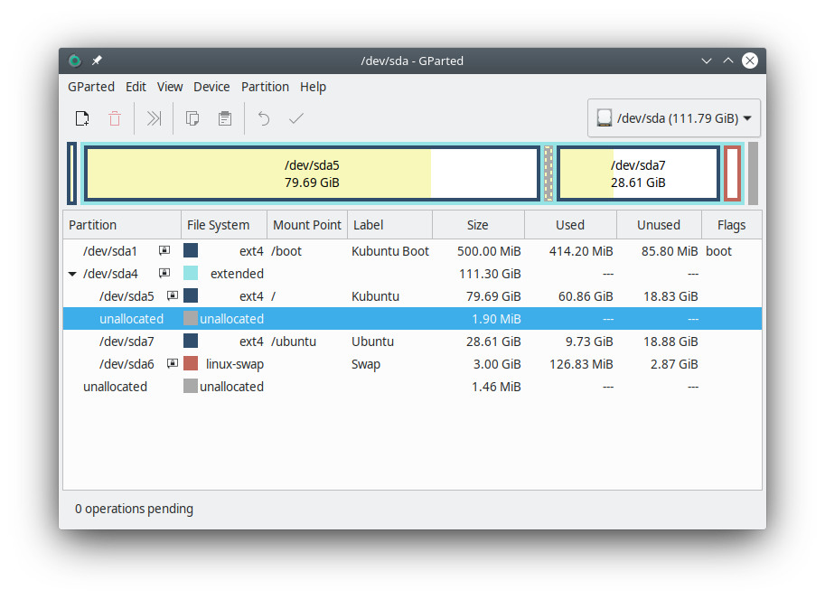

**Utworzony* 24.03.2021*

# Konfiguracja pamięci wymiany (swap)

Pamięć wymiany, to rozszerzenie pamięci RAM o część fizycznej pamięci na dysku twardym. Obie pamięci są ze sobą połączone. Dzięki temu na komputerze można uruchomić bardziej zasobożerne programy lub sprawić, że stary komputer będzie działał lepiej. W dzisiejszym artykule opowiem, w jaki sposób rozszerzyć pamięć w systemie Linux (funkcjonalność kernela).

## Sprawdzenie stanu

W systemie GNU/Linux wiele zadań administracyjnych wykonuje się w terminalu, używając komend które najczęściej są zainstalowanymi w systemie programami. Również dodanie pamięci swap będzie odbywało się w całości w powłoce bash.

Komenda `free` wyświetli nam bieżący stan pamięci RAM i swap. Najwygodniej jest ją używać z parametrem `-h`, który wyświetli dostępną i zajętą pamięć w przyjaznych dla człowieka jednostkach: GiB i MiB.

```
$ free -h
			razem	użyte	wolne	dzielone	buf/cache	dostępne
Pamięć:		2,8Gi	1,1Gi	484Mi	304Mi		1,2Gi		1,2Gi
Wymiana:	4,4Gi	967Mi	3,5Gi	
```

Komenda `swapon` jest przeznaczona do uruchamiania pamięci swap, ale użyta z parametrem `--show` wyświetli bieżący stan każdej z pamięci swap (można ich mieć kilka):

```
$ swapon --show
NAME		TYPE		SIZE	USED	PRIO
/swapfile	file		1,5G	833,7M	-2
/dev/sda6	partition	3G		130,1M	-3
```

Jak widać, ja mam ustawiony swap w pliku `/swapfile`, oraz na partycji `/dev/sda6`. O partycjach w Linuxie mówiliśmy w [poprzednim artykule](system-plików-linuxa.md) o systemie plików.

## Konfiguracja swap-u w pliku

Zarówno partycja *linux-swap*, jak i plik swap są stałego rozmiaru. Plik swap trzeba utworzyć ręcznie komendą:

```bash
sudo dd if=/dev/zero of=/swapfile bs=1M count=1536
```

To może zająć chwilę. Komenda skopiuje 1536 MiB (1.5 GiB) z wirtualnego urządzenia `/dev/zero` do pliku `/swapfile`. Plik ten może mieć dowolną nazwę i ścieżkę, jednak ta lokalizacja i nazwa jest ogólnie przyjętą konwencją. O urządzeniach wirtualnych również pisałem w poprzednim artykule, a `/dev/zero`, to niekończący się "zbiornik" zer (bitów). W efekcie utworzony zostanie plik o rozmiarze 1.5 GiB wypełniony pustymi bajtami.

Plik swap musi należeć do użytkownika `root`. Jeżeli wywołaliśmy powyższą komendą z sudo, utworzony plik powinien "z automatu" zostać przyporządkowany do użytkownika i grupy `root`. Jeżeli tego nie zrobiliście, zmieńcie użytkownika i grupę komendą `chown`.

```bash
sudo chown root: /swapfile
```

Następnie ustawcie uprawnienia dla właściciela do odczytu i zapisu, a dla grupy i pozostałych użytkowników odmówcie wszystkich uprawnień (-rw-------).

```bash
sudo chmod 600 /swapfile
```

Plik swapfile jest gotowy. Teraz ustawimy go jako rozszerzenie pamięci.

```bash
sudo mkswap /swapfile
```

Jeżeli plik nie ma odpowiednich uprawnień, program wyświetli błąd o treści:

*mkswap: /swapfile: niebezpieczne uprawnienia 0644, powinno być 0600.*

Komenda mkswap nie zmieni niczego w systemie, a jedynie zapisze w pliku `/swapfile` odpowiednie dane - coś podobnego formatowania partycji.

Na koniec włączymy swap do pamięci Linuxa. Po wykonaniu tej komendy dostępne miejsce powinno się natychmiast zwiększyć.

```bash
sudo swapon /swapfile
```

Jeżeli nie wykonamy poprzedniej operacji "formatowania" pliku, program wyświetli błąd:

*swapon: /swapfile: odczyt nagłówka swapa nie powiódł się*

Komenda `swapon --show` będzie teraz wyświetlać nowy rekord.

## Konfiguracja swap-u na oddzielnej partycji

Partycje swap są sformatowane na format *linux-swap*. Nową partycję najłatwiej będzie utworzyć za pomocą graficznego menedżera partycji, jak Gparted. Można go zainstalować komendą`sudo apt install gparted`. Oczywiście dotyczy to tylko dystrybucji używających menedżera pakietów apt.

Najwygodniej będzie dodać partycję wymiany na samym końcu dysku, ponieważ nie będzie wtedy przeszkadzać w dodawaniu innych partycji, na przykład na inne dystrybucje GNU/Linuxa.



Jeżeli instalowaliście GNU/Linuxa obok Windowsa, powinniście widzieć w podglądzie 3 partycje z lewej strony dla Windowsa, oraz jedną partycję z prawej strony dla GNU/Linuxa. Jeżeli zainstalowaliście GNU/Linuxa jako jedyny system na dysku, powinniście widzieć jedną partycję na cały dysk. Linux nie pozwoli na modyfikację własnej partycji, bo wymaga to odmontowania głównego węzła systemu plików przed modyfikacją, a po odmontowaniu wszystko przestałoby działać.

Aby zmniejszyć partycję rootfs, konieczne jest najpierw uruchomienie Linuxa z innej partycji. Jeżeli wasza dystrybucja posiada tryb Live CD (testowanie systemu bez instalacji), uruchomcie ją z pendriva którego użyliście do instalacji. Opisałem to [tutaj](wprowadzenie-instalacja-gnu-linux.md#nagrywanie-obrazu-dysku). Polecam zachować obraz iso po instalacji, bo może się jeszcze przydać. Jeżeli wasza dystrybucja nie posiada trybu Live CD, możecie pobrać obraz specjalnej dystrybucji GNU/Linuxa, przeznaczonej do tego typu zadań, na przykład *All in One System Rescue Toolkit*. Plik waży nieco ponad 600 MiB.

Następnie uruchomcie program do zarządzania partycjami lub jeżeli takiego nie ma, zainstalujcie Gparted. Teraz możecie zmniejszyć partycję Linuxa na dysku, dodać nową na końcu i sformatować na *linux-swap*.

## Konfiguracja fstab

Niezależnie od tego, którą wersję rozszerzenia pamięci wybierzemy, przy aktualnej konfiguracji przy każdym uruchomieniu systemu będziemy musieli włączać swap komendą: `sudo swapon [adres-pliku]`. Możemy to jednak zautomatyzować zmieniając zawartość pliku konfiguracyjnego `/etc/fstab`. W pliku tym zawarte są informacje na temat punktów montowania partycji.

```config
# /etc/fstab: static file system information.
#
# Use 'blkid' to print the universally unique identifier for a
# device; this may be used with UUID= as a more robust way to name devices
# that works even if disks are added and removed. See fstab(5).
#
# <file system>								<mount point>	<type>	<options>			<dump> <pass>
UUID=e889109b-d785-43d8-838d-5a629e888970	/				ext4	errors=remount-ro	0		1
/dev/sda7                               	/ubuntu			ext4	defaults			0		2
#UUID=7fc1c01c-7a95-40ca-bfba-82041e77506e	/boot			ext4	defaults			0		2
#UUID=fdae9e72-6b44-4a66-a36a-4d59d2bd25ce	/boot			ext4	defaults			0		2
UUID=fdae9e72-6b44-4a66-a36a-4d59d2bd25ce	/boot			ext4	defaults			0		2
/swapfile								none			swap	sw					0		0
/dev/sda6								none			swap	sw					0		0
# / was on /dev/sda5 during installation
```

Otwórzcie plik w dowolnym edytorze kodu, na przykład nano:

```bash
sudo nano /etc/fstab
```

I dodajcie plik lub partycję wymiany analogicznie jak na powyższym przykładzie. Przerwy między kolumnami to zwykłe białe znaki - spacje lub tabulatory.

## Wyłączanie swap-u

Pamięć swap można także wyłączyć poleceniem `swapoff`, ale należy z nim uważać, ponieważ wtedy cała jego pamięć zostanie przeniesiona, najczęściej do RAM-u. Jego przepełnienie spowoduje zawieszenie się komputera (można go wtedy zrestartować używając kombinacji klawiszy: Alt-Print Screen (lub System Request), a następnie przytrzymując Alt, Alt-B)[^1]. Przed wykonaniem tej operacji warto wyłączyć wszystkie programy, które mogą obciążać pamięć.

```bash
# Wyłącz jeden swap
sudo swapoff /dev/sda6
# Wyłącz wszystkie swap-y
sudo swapoff -a
```

Dopóki nie odmontujemy pliku swap, nie będziemy mogli go usunąć.

I to by było na tyle, jeżeli chodzi o zarządzanie pamięcią wymiany. Mam nadzieję, że pomogłem w lepszym zrozumieniu jak działa ten mechanizm.

[^1]: Jest to tzw. *magic system request*, polecenie wysyłane bezpośrednio do jądra Linuxa. Wykona się bez względu na to, czy komputer jest zawieszony, czy nie.
