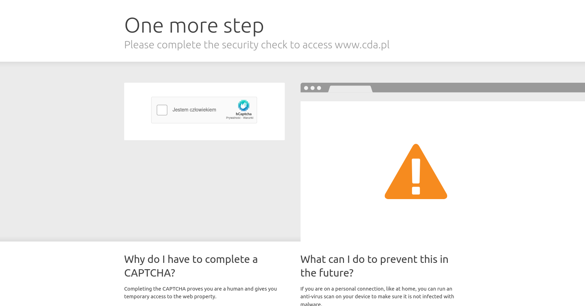

*Utworzony 16.07.2021*

# Ochrona serwera vs swobodny dostęp do usługi

Wiele serwisów sieciowych jest zabezpieczonych przez zewnętrzną usługę przed atakami DDOS - polegającymi na zasypywaniu serwera zapytaniami. Serwer próbuje na nie odpowiadać i w efekcie zawiesza się, a usługa staje się niedostępna. Często ta ochrona polega na wyświetlaniu captchy przed wyświetleniem strony. Użytkownicy TOR-a często muszą ją rozwiązywać, bo usługi takie jak Cloudflare (z którego korzysta większość stron), albo Imunify (Google) domyślnie blokują adresy IP węzłów wyjściowych TOR. Jednak dopiero ostatnio zacząłem się zastanawiać, dlaczego. Czy tak często wychodzą z nich ataki DDOS? A może używanie TOR-a wydaje się przez nich podejrzaną, nietypową aktywnością? Ja mam inną teorię.

Używając TOR-a od około pół roku, przyzwyczaiłem się do pewnych niedogodności. Zauważyłem w tym czasie, że Cloudflare wprowadza pewne drobne zmiany w swojej usłudze. Ostatnio na przykład stworzył wtyczkę do Firefoxa *"Privacy pass"*, dzięki której nie musimy rozwiązywać captchy tak często - po każdym rozwiązaniu dostajemy 30 tokenów, które są następnie odejmowane z licznika zamiast wyświetlania kolejnej captchy. Oprócz tego dodają też nowe rodzaje kategorii (zawsze były rowery i łodzie, ale od czasu do czasu natrafiam na samoloty lub ciężarówki).

Tylko po co w ogóle blokować węzły TOR-a? Nawet jeżeli spod jakiegoś adresu IP wyszedł już atak DDOS, nie trwa on wiecznie. Cloudflare mógłby dać bana np. na 1 dzień, ale tylko w przypadku prawdziwego ataku. Czasami kilkukrotne odświeżenie strony (bo nie chce się załadować) zostaje właśnie tak zinterpretowane.

Jeszcze gorzej jest z captchą Google, stosowaną m.in. na YouTubie. Nie dość, że bardzo trudno ją rozwiązać poprawnie, to za "atak" zostanie uznana nawet próba pobrania filmiku przy pomocy youtube-dl, wpisanie linku do filmu w wyszukiwarce albo otwarcie YouTube w trybie Incognito (bez cookies). Także w wielu innych serwisach wystarczy zaledwie kilka-kilkanaście zapytań w krótkim czasie, i już zostajecie wyrzuceni. Niektóre strony jak Netflix (ale nie tylko), w ogóle nie pozwalają na wyświetlenie jej zawartości, wyrzucając błąd 403. Przyczyna jest oczywista.

Jest jeszcze jeden problem. Dzisiaj captchy nie można rozwiązać bez JavaScriptu, może poza sporadycznymi wyjątkami. Mimo że prawie wszyscy mają go włączonego, to zdarzają się też osoby, które wolą go wyłączyć (wydaje mi się, że liczba tych osób ostatnio nieco wzrosła). Po co wyłączać JavaScript? JavaScript ułatwia śledzenie, a nie każdemu jest potrzebny, zwłaszcza tym którzy używają internetu głównie do wyszukiwania i czytania artykułów. Robiąc to mogą w dużej mierze pozbyć się reklam (i okienek wymuszających wyłączenie AdBlocka). Dziś dzięki HTML5 większość stron nie potrzebuje JavaScript do działania. Niestety usługi takie jak Cloudflare czy ReCaptcha zmuszają do pozostawienia JavaScriptu włączonego przez cały czas.

Ten problem też da się rozwiązać: można stworzyć alternatywną captchę, która nie wymaga JavaScriptu do działania i wyświetlać ją zamiast informacji "musisz włączyć JavaScript aby rozwiązać captchę". I nie jest to takie trudne do wdrożenia, a mogłoby być tak samo bezpieczne jak captcha w obecnej formie. Jednak to te firmy muszą wprowadzić zmianę.

Myślę, że w tym wszystkim chodzi nie tylko o bezpieczeństwo serwera, ale przede wszystkim o zniechęcenie ludzi do maskowania swojego adresu IP i omijania ograniczeń geolokalizacji, oraz o nasze dane osobowe. Chcą nakłonić ludzi do powrotu do "normalnego" internetu.

Zaproponowałem 2 rzeczy, które Cloudflare i Google mogą zrobić - nie blokować domyślnie węzłów wyjściowych TOR, ale okresowo blokować adres IP tylko w przypadku prawdziwego ataku, oraz umożliwić wyświetlenie strony bez JavaScriptu - aby uczynić internet nieco lepszym i bardziej dostępnym miejscem dla każdego.