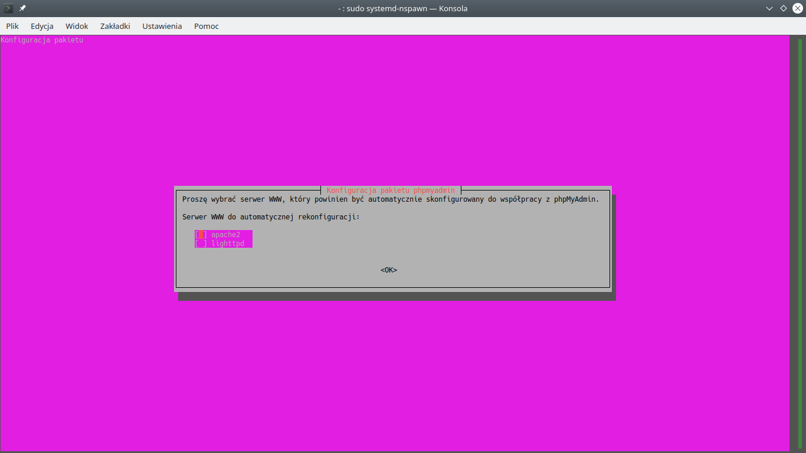

*Utworzony 29.03.2021*

# Serwer www w systemie GNU/Linux

O ile postawienie prostej strony www na XAMPP-ie w Windowsie jest dosyć proste, to konfiguracja serwerów sieciowych w GNU/Linuxie może na początku sprawiać pewne problemy, między innymi dlatego, że zarządza się nimi wyłącznie z poziomu terminala. W dzisiejszym artykule znowu poznacie kilka komend. Opiszę dokładnie jak zainstalować i skonfigurować serwery apache2 i mySQL oraz hosty wirtualne.


Przyjrzyjcie się powyższemu screenshotowi przedstawiającemu panel kontrolny XAMPP-a. Składa się on z kilku modułów-usług, które możemy włączać i wyłączać. Najważniejsze to:

- Apache - Serwer www obsługujący zapytania http dzięki któremu użytkownicy mogą wyświetlać strony w przeglądarce. Działa na porcie 80 dla http i 443 dla https.
- MySQL - Serwer baz danych MySQL z którym łączy się serwer Apache, zapewnia łatwe zarządzanie dużą ilością danych tabelarycznych. W bazach danych przechowuje się dane logowania użytkowników i inne dynamiczne informacje. Działa na porcie 3306.
- FileZilla - Program zarządzający serwerem ftp do przesyłania plików między klientem a serwerem. Protokół ftp działa na portach 20 i 21.

Istnieje także więcej usług sieciowych, na przykład ssh, telnet, dns, czy email. W GNU/Linuxie każda z tych usług jest odrębnym programem. Zaczniemy od instalacji serwera apache2.

## apache2

Program oczywiście zainstalujemy komendą:

```bash
sudo apt install apache2
```

Stan usługi możemy sprawdzić na kilka sposobów. Możemy używać tego, który jest dla nas najwygodniejszy.

```
$ systemctl status apache2
● apache2.service - The Apache HTTP Server
     Loaded: loaded (/lib/systemd/system/apache2.service; enabled; vendor preset: enabled)
     Active: active (running) since Tue 2021-03-23 17:16:23 CET; 1 day 17h ago
       Docs: https://httpd.apache.org/docs/2.4/
    Process: 59398 ExecReload=/usr/sbin/apachectl graceful (code=exited, status=0/SUCCESS)
   Main PID: 954 (apache2)
      Tasks: 11 (limit: 3324)
     Memory: 125.4M
     CGroup: /system.slice/apache2.service
             ├─  954 /usr/sbin/apache2 -k start
             ├─59416 /usr/sbin/apache2 -k start
             ├─59417 /usr/sbin/apache2 -k start
             ├─59418 /usr/sbin/apache2 -k start
             ├─59440 /usr/sbin/apache2 -k start
             ├─59535 /usr/sbin/apache2 -k start
             ├─59579 /usr/sbin/apache2 -k start
             ├─59581 /usr/sbin/apache2 -k start
             ├─59687 /usr/sbin/apache2 -k start
             ├─65378 /usr/sbin/apache2 -k start
             └─65379 /usr/sbin/apache2 -k start

Warning: some journal files were not opened due to insufficient permissions.
```
```
$ /etc/init.d/apache2 status
● apache2.service - The Apache HTTP Server
     Loaded: loaded (/lib/systemd/system/apache2.service; enabled; vendor preset: enabled)
     Active: active (running) since Tue 2021-03-23 17:16:23 CET; 1 day 17h ago
       Docs: https://httpd.apache.org/docs/2.4/
    Process: 59398 ExecReload=/usr/sbin/apachectl graceful (code=exited, status=0/SUCCESS)
   Main PID: 954 (apache2)
      Tasks: 11 (limit: 3324)
     Memory: 124.7M
     CGroup: /system.slice/apache2.service
             ├─  954 /usr/sbin/apache2 -k start
             ├─59416 /usr/sbin/apache2 -k start
             ├─59417 /usr/sbin/apache2 -k start
             ├─59418 /usr/sbin/apache2 -k start
             ├─59440 /usr/sbin/apache2 -k start
             ├─59535 /usr/sbin/apache2 -k start
             ├─59579 /usr/sbin/apache2 -k start
             ├─59581 /usr/sbin/apache2 -k start
             ├─59687 /usr/sbin/apache2 -k start
             ├─65378 /usr/sbin/apache2 -k start
             └─65379 /usr/sbin/apache2 -k start

Warning: some journal files were not opened due to insufficient permissions.
```
```
$ service apache2 status
● apache2.service - The Apache HTTP Server
     Loaded: loaded (/lib/systemd/system/apache2.service; enabled; vendor preset: enabled)
     Active: active (running) since Tue 2021-03-23 17:16:23 CET; 1 day 17h ago
       Docs: https://httpd.apache.org/docs/2.4/
    Process: 59398 ExecReload=/usr/sbin/apachectl graceful (code=exited, status=0/SUCCESS)
   Main PID: 954 (apache2)
      Tasks: 11 (limit: 3324)
     Memory: 123.3M
     CGroup: /system.slice/apache2.service
             ├─  954 /usr/sbin/apache2 -k start
             ├─59416 /usr/sbin/apache2 -k start
             ├─59417 /usr/sbin/apache2 -k start
             ├─59418 /usr/sbin/apache2 -k start
             ├─59440 /usr/sbin/apache2 -k start
             ├─59535 /usr/sbin/apache2 -k start
             ├─59579 /usr/sbin/apache2 -k start
             ├─59581 /usr/sbin/apache2 -k start
             ├─59687 /usr/sbin/apache2 -k start
             ├─65378 /usr/sbin/apache2 -k start
             └─65379 /usr/sbin/apache2 -k start

Warning: some journal files were not opened due to insufficient permissions.
```
```
$ apachectl status
               Apache Server Status for localhost (via 127.0.0.1)

   Server Version: Apache/2.4.41 (Ubuntu) OpenSSL/1.1.1f

   Server MPM: prefork

   Server Built: 2020-08-12T19:46:17

     ----------------------------------------------------------------------

   Current Time: Thursday, 25-Mar-2021 10:50:47 CET

   Restart Time: Tuesday, 23-Mar-2021 17:16:23 CET

   Parent Server Config. Generation: 3

   Parent Server MPM Generation: 2

   Server uptime: 1 day 17 hours 34 minutes 24 seconds

   Server load: 0.81 0.81 0.88

   Total accesses: 1624 - Total Traffic: 2.5 MB - Total Duration: 1768282

   CPU Usage: u210.69 s10.31 cu582.63 cs19.11 - .55% CPU load

   .0109 requests/sec - 17 B/second - 1619 B/request - 1088.84 ms/request

   1 requests currently being processed, 9 idle workers

 ._______W_._....................................................
 ................................................................
 ......................

   Scoreboard Key:
   "_" Waiting for Connection, "S" Starting up, "R" Reading Request,
   "W" Sending Reply, "K" Keepalive (read), "D" DNS Lookup,
   "C" Closing connection, "L" Logging, "G" Gracefully finishing,
   "I" Idle cleanup of worker, "." Open slot with no current process
```

Dla mnie najwygodniejsza jest komenda `systemctl`, ponieważ dla każdej z usług zapewnia taki sam sposób obsługi. Z kolei `apachectl` wyświetla najwięcej szczegółów.

```bash
# sprawdzenie stanu serwera
systemctl status apache2
# uruchomienie serwera
sudo systemctl start apache2
# zatrzymanie serwera
sudo systemctl stop apache2
# restart serwera
sudo systemctl restart apache2
# przeładowanie ustawień - czyli taki szybszy restart
sudo systemctl reload apache2
```

Cóż... musimy się przyzwyczaić, że przy każdym starcie i zatrzymywaniu usługi będziemy podawać hasło. Ale jeżeli zajmujecie się tylko tworzeniem stron, nie będziecie często korzystać z tych komend. Usługi sieciowe uruchomią się automatycznie wraz ze startem Linuxa.

Po zainstalowaniu serwera apache2 możecie wpisać w przeglądarkę adres [localhost](http://localhost) lub [127.0.0.1](http://127.0.0.1). Powinna się wyświetlić taka strona:


Lokalizacja plików www może się różnić w zależności od dystrybucji GNU/Linuxa. W Ubuntu pliki są zlokalizowane w `/var/www/html`. Jeżeli nie możecie znaleźć tego katalogu, sprawdźcie wartość `DocumentRoot` pliku `/etc/apache2/sites-available/000-default.conf`.

```
$ cat /etc/apache2/sites-available/000-default.conf | grep DocumentRoot
        DocumentRoot /var/www/html
```

Modyfikator `grep` wyszukuje w tekście odpowiednią wartość i wyświetla tylko te wartości w których występuje.

Oryginalnie zarówno katalog www, jak i html, należą do użytkownika `root`, dlatego nie możemy modyfikować jego zawartości. Wykonywanie wszystkich operacji jako root byłoby nierozsądne, dlatego przed edycją zmienimy właściciela pliku na własny.

```bash
sudo chown -R ja: /var/www
```

Parametr `-R` zadziała rekursywnie, to znaczy że oprócz samego katalogu wybierze wszystkie pliki znajdujące się w nim.

## php

Domyślnie apache2 nie zawiera php, dlatego trzeba je doinstalować oddzielnie. Z tym też nie ma zbyt wielkiej filozofii:

```bash
sudo apt install php
```

Jeżeli chcecie sprawdzić, czy php działa, utwórzcie plik `/var/www/html/index.php` o treści:

```php+HTML
<?php
phpinfo();
```

I otwórzcie [stronę](http://localhost) w przeglądarce. Poza tym php można stosować nie tylko w przeglądarce, ale też w terminalu jak normalne programy, i odpalać je z dowolnego miejsca. Na tej zasadzie działa np. Composer.

```php
#!/usr/bin/php
<?php
echo "Hello, world!";
```

Żeby można było uruchomić taki skrypt, trzeba mu jeszcze nadać uprawnienia do wykonania:

```bash
chmod u+x script.php
./script.php
```

## mySQL

Konfiguracja mySQL jest nieco trudniejsza od apache2, zwłaszcza jeżeli jesteście przyzwyczajeni do zarządzania bazami poprzez graficzne narzędzia jak phpmyadmin, czego domyślnie pakiet `mysql-server` nie dostarcza. Dlaczego? Ponieważ nie każdy tego potrzebuje. Zainstalujmy mySQL komendą:

```bash
sudo apt install mysql-server
```

Administrację mySQL możemy przeprowadzać przez terminal zwyczajnie wpisując zapytania. Zalogujmy się teraz jako root do mySQL.

```
$ sudo mysql
Welcome to the MySQL monitor.  Commands end with ; or \g.
Your MySQL connection id is 9
Server version: 8.0.23-0ubuntu0.20.04.1 (Ubuntu)

Copyright (c) 2000, 2021, Oracle and/or its affiliates.

Oracle is a registered trademark of Oracle Corporation and/or its
affiliates. Other names may be trademarks of their respective
owners.

Type 'help;' or '\h' for help. Type '\c' to clear the current input statement.

mysql> show databases;
+--------------------+
| Database           |
+--------------------+
| information_schema |
| mysql              |
| performance_schema |
| sys                |
+--------------------+
4 rows in set (0.00 sec)

mysql> use mysql;
Reading table information for completion of table and column names
You can turn off this feature to get a quicker startup with -A

Database changed
mysql> select user,plugin from user;
+------------------+-----------------------+
| user             | plugin                |
+------------------+-----------------------+
| debian-sys-maint | caching_sha2_password |
| mysql.infoschema | caching_sha2_password |
| mysql.session    | caching_sha2_password |
| mysql.sys        | caching_sha2_password |
| root             | auth_socket           |
+------------------+-----------------------+
5 rows in set (0.00 sec)

mysql>
```

Program można zamknąć kombinacją klawiszy ctrl-D (^D). Ważna uwaga: **nie polecam zmieniać pluginu uwierzytelniania**. Plugin `auth_socket` umożliwia nam łatwe i bezpieczne logowanie do roota. Łatwe, bo nie ma potrzeby ustawiać hasła, zamiast tego logujemy się na konto przy pomocy dobrze znanego nam sudo. Bezpieczne, bo nie ma dostępu do roota z sieci. Domyślnie każdy nowo utworzony użytkownik będzie miał plugin `caching_sha2_password`, ale **zmieniając plugin roota możemy uniemożliwić sobie zalogowanie do bazy**, i przez hasło, i sudo. Oczywiście istnieją sposoby na naprawienie tego, mySQL ma zaimplementowany pewien awaryjny backdoor który pozwala wykonać dowolne zapytanie jako root, ale lepiej żeby się nie przydał.

Używanie mySQL w php wymaga zainstalowania dodatkowego pakietu `php-mysql`. Po nim trzeba przeładować apache2.

```bash
sudo apt install php-mysql
sudo systemctl reload apache2
```

Inaczej php wyrzuci błąd *"**Fatal error**:  Uncaught Error: Class 'mysqli' not found"*.

### Tworzenie konta mySQL

Utwórzmy teraz prosty skrypt w php aby przetestować czy ma dostęp do mySQL:

```php
<?php
// php w wersji na Linuxa domyślnie ukrywa wszystkie błędy
ini_set("display_errors", 1);
$conn = new mysqli("localhost", "web", "12345");
if (!is_null($conn->connect_error)) {
        die($conn->connect_error);
}
echo "MySQL działa!";
```

Jeżeli mySQL nie zadziała, wyrzuci błąd, a jeżeli wszystko pójdzie dobrze, wyświetli na ekranie tekst "MySQL działa!".

Teraz utwórzmy sobie konto `web` . W tym celu zalogujemy się do mySQL w terminalu jako root.

```
$ sudo mysql
Welcome to the MySQL monitor.  Commands end with ; or \g.
Your MySQL connection id is 15
Server version: 8.0.23-0ubuntu0.20.04.1 (Ubuntu)

Copyright (c) 2000, 2021, Oracle and/or its affiliates.

Oracle is a registered trademark of Oracle Corporation and/or its
affiliates. Other names may be trademarks of their respective
owners.

Type 'help;' or '\h' for help. Type '\c' to clear the current input statement.

mysql> create user web@localhost identified by '12345';
Query OK, 0 rows affected (0.07 sec)

mysql> select user from mysql.user;
+------------------+
| user             |
+------------------+
| web              |
| debian-sys-maint |
| mysql.infoschema |
| mysql.session    |
| mysql.sys        |
| root             |
+------------------+
6 rows in set (0.00 sec)

mysql> 
```

Do konta web możemy też zalogować się przy pomocy terminala.

```bash
mysql -u web -p
```

Argument `-u` to oczywiście nazwa użytkownika, a `-p` informuje program, że mamy zamiar wpisać hasło. Pominięcie tego parametru będzie w tym przypadku skutkowało próbą zalogowania się na konto `web` bez hasła. Zostanie wyrzucony błąd o następującej treści:

*ERROR 1045 (28000): Access denied for user 'web'@'localhost' (using password: NO)*

### Nadawanie uprawnień

Nowo utworzony użytkownik nie posiada żadnych uprawnień. Utworzymy teraz bazę danych o tej samej nazwie i przydzielimy do niej użytkownikowi wszystkie uprawnienia.

```
mysql> create database web;
Query OK, 1 row affected (0.05 sec)

mysql> grant all on web.* to web@localhost;
Query OK, 0 rows affected (0.02 sec)

mysql> flush privileges;
Query OK, 0 rows affected (0.02 sec)

mysql> show grants for web@localhost;
+------------------------------------------------------+
| Grants for web@localhost                             |
+------------------------------------------------------+
| GRANT USAGE ON *.* TO `web`@`localhost`              |
| GRANT ALL PRIVILEGES ON `web`.* TO `web`@`localhost` |
+------------------------------------------------------+
2 rows in set (0.00 sec)

mysql>
```

```mysql
# Nadawanie uprawnień
grant privileges on database.table to user;
# Odbieranie uprawnień
revoke privileges on database.table from user;
```

Uprawnienie `USAGE` to uprawnienie zerowe. Nie robi nic.

### Instalacja phpmyadmin

Phpmyadmin to webowa aplikacja do zarządzania bazami mySQL. Jeżeli chcecie zainstalować phpmyadmin, możecie pobrać archiwum ze [strony phpmyadmin](https://www.phpmyadmin.net/downloads/), a następnie wypakować je w katalogu ze stroną, lepiej jednak jest użyć menedżera pakietów apt. Standardowo odpalamy `sudo apt install phpmyadmin`. A tu niespodzianka:



Podczas instalacji i dezinstalacji pakietów deb może zostać wykonane dowolne polecenie. Zazwyczaj jest to automatyczna konfiguracja której nie zauważamy. Tutaj jednak polecenie spowoduje zadanie nam serii pytań na które musimy odpowiedzieć.

| pytanie                                                 | odpowiedź           |
| ------------------------------------------------------- | ------------------- |
| Serwer WWW do automatycznej konfiguracji                | apache2             |
| Configure database for phpmyadmin with dbconfig-common? | Tak                 |
| MySQL application password for phpmyadmin               | hasło do phpmyadmin |
| Password confirmation                                   | powtórz hasło       |

Po odpowiedzeniu na te pytania powinna automatycznie utworzyć się baza danych i użytkownik `phpmyadmin` . Możecie sprawdzić, czy rzeczywiście tak się stało zapytaniem:

```mysql
select user from mysql.user;
show databases;
```

Teraz możecie otworzyć stronę [localhost/phpmyadmin](http://localhost/phpmyadmin) i zalogować się, używając loginu `phpmyadmin` i ustawionego hasła. Często się zdarza, że serwer apache2 nie wykryje aliasu *localhost/phpmyadmin*, ponieważ pliki www znajdują się w innej niż domyślnie lokalizacji, więc strona się nie wyświetli. Problem ten można rozwiązać, includując plik `/etc/phpmyadmin/apache.conf` w konfiguracji apache2. Wystarczy na końcu pliku `/etc/apache2/apache2.conf` wpisać:

```
Include /etc/phpmyadmin/apache.conf
```

Na koniec przeładujcie serwer apache2.

Jeżeli macie problem z zalogowaniem się do panelu, lub nie są w nim widoczne wszystkie opcje lub bazy danych, przyczyną tego może być błędna konfiguracja. Poniżej wypisałem kilka poleceń, które mogą pomóc w samodzielnym rozwiązaniu tego problemu.

*bash*

```bash
# Uruchamia ponownie automatyczną konfigurację, ale bez dbconfig-common
sudo dpkg-reconfigure phpmyadmin
# Pamiętajcie, aby plugin uwierzytelniania ustawić na caching_sha2_password. Pozostałe ustawienia prawdopodobnie mogą pozostać domyślne.
```

*mySQL*

```mysql
# Tworzy bazę phpmyadmin
create database phpmyadmin;
# Tworzy użytkownika phpmyadmin
create user phpmyadmin@localhost identified by 'password'
# Przydziela wszystkie uprawnienia do phpmyadmin, włącznie z uprawnieniem do zarządzania uprawnieniami
grant all on *.* to phpmyadmin@localhost with grant option;
# Usuwa bazę phpmyadmin
drop database phpmyadmin;
# Usuwa użytkownika phpmyadmin
drop user phpmyadmin@localhost;
```

Jeżeli phpmyadmin działa, powinno dać się do niego zalogować za pomocą konta phpmyadmin, wyświetlać wszystkie bazy danych, w tym systemowe `mysql`, `phpmyadmin`, `sys`, `information_schema` i `performance_schema`, oraz wyświetlać opcję zarządzania użytkownikami. Nie muszę chyba tłumaczyć, jak zarządzać bazami poprzez phpmyadmin.

## Hosty wirtualne

Na tym nie kończy się konfiguracja serwera. Pozostała jeszcze kwestia hostów wirtualnych. Ogólnie chodzi o to, że do strony odwołujemy się nie poprzez adres IP, a domenę - którą samą możecie sobie wymyślić. Localhost jest jedną z takich domen. Zaletą hostów wirtualnych jest nie tylko wygoda, ale przede wszystkim możliwość postawienia więcej niż jednej strony na serwerze. Gdybyśmy nie korzystali z domen, moglibyśmy je rozdzielić pomiędzy oddzielne katalogi w `/var/www/html`, ale w rzeczywistości nadal należałyby do tego samego hosta. Natomiast wadą hostów wirtualnych jest ograniczenie dostępu. Domyślnie do domeny będziemy mieli dostęp tylko z serwera na którym się znajduje, a otwarcie strony na innym urządzeniu będzie wymagać ustawienia na nim adresu IP naszego serwera jako serwer DNS, albo skonfigurowania routera do pracy z lokalnymi domenami, jeżeli router to obsługuje.

Przydzielaniem domen do adresów IP - w naszym przypadku wszystkich do lokalnego serwera - zajmuje się serwer nazw: DNS (*Domain name system*). Otwarcie domeny na serwerze nie będzie wymagać instalacji żadnego dodatkowego oprogramowania, ale my chcemy rozszerzyć jego dostęp na inne urządzenia w sieci, dlatego zainstalujemy program *dnsmasq*.

Zanim to zrobimy, zmieńmy zawartość pliku `/etc/hosts`.

```
127.0.0.1	localhost
127.0.0.1	[computer-hostname]

# The following lines are desirable for IPv6 capable hosts
::1			ip6-localhost ip6-loopback
fe00::0		ip6-localnet
ff00::0		ip6-mcastprefix
ff02::1		ip6-allnodes
ff02::2		ip6-allrouters
```

Jak widzicie, początkowo plik ten zawiera już 2 domeny: localhost i nazwa waszego komputera. Otwarcie każdej z nich w przeglądarce skutkować będzie odpaleniem strony z `/var/www/html`. Nie polecam usuwać żadnej z nich, a zwłaszcza nazwy komputera przy pomocy której GNU/Linux rozpoznaje samego siebie. Jeżeli chcemy zmienić nazwę komputera bez ryzyka błędu, najpierw dodamy tutaj domenę z nową nazwą, a dopiero potem zmienimy nazwę której szuka tutaj system.

Istnieje specjalna grupa domen `.local` przeznaczona do sieci lokalnych. Ponieważ nie są, a przynajmniej nie powinny być stosowane w internetowym systemie DNS, możemy wybrać sobie dowolną nazwę kończącą się na .local bez ryzyka kolizji. Jeżeli jednak chcecie utworzyć lokalną domenę .com, .pl, .org, .net lub inną, warto ją najpierw zpingować aby sprawdzić czy nie jest zajęta.

```bash
ping example.com
```

Dodajcie nową domenę w pliku `/etc/hosts` pod adresem IP `127.0.0.1`, czyli tzw. *pętlą zwrotną* - adres który zawsze będzie wskazywał na samego siebie. Ja dla przykładu utworzę domenę libremail.local.

```
127.0.0.1	localhost
127.0.0.1	[computer-hostname]
127.0.0.1	libremail.local

# The following lines are desirable for IPv6 capable hosts
::1			ip6-localhost ip6-loopback
fe00::0		ip6-localnet
ff00::0		ip6-mcastprefix
ff02::1		ip6-allnodes
ff02::2		ip6-allrouters
```

Po zapisaniu pliku można już pingować domeną libremail.local, ale otwarcie jej w przeglądarce będzie skutkowało wyświetleniem domyślnej strony apache2. Teraz skonfigurujemy apache2 tak, aby otrzymując żądanie na domenę libremail.local wyświetlił stronę z `/var/www/libremail`.

Przejdźmy teraz do katalogu `/etc/apache2/sites-available`. Tworzymy tutaj plik libremail.conf. Dla ułatwienia możemy skopiować konfigurację domyślnej strony i edytować ją.

```
$ cd /etc/apache2/sites-available
/etc/apache2/sites-available$ ls
000-default.conf  default-ssl.conf
/etc/apache2/sites-available$ sudo cp 000-default.conf libremail.conf
[sudo] hasło użytkownika user:
/etc/apache2/sites-available$ sudo nano libremail.conf
```

```
<VirtualHost *:80>
        # The ServerName directive sets the request scheme, hostname and port that
        # the server uses to identify itself. This is used when creating
        # redirection URLs. In the context of virtual hosts, the ServerName
        # specifies what hostname must appear in the request's Host: header to
        # match this virtual host. For the default virtual host (this file) this
        # value is not decisive as it is used as a last resort host regardless.
        # However, you must set it for any further virtual host explicitly.
        #ServerName www.example.com

        ServerAdmin webmaster@localhost
        DocumentRoot /var/www/html

        # Available loglevels: trace8, ..., trace1, debug, info, notice, warn,
        # error, crit, alert, emerg.
        # It is also possible to configure the loglevel for particular
        # modules, e.g.
        #LogLevel info ssl:warn

        ErrorLog ${APACHE_LOG_DIR}/error.log
        CustomLog ${APACHE_LOG_DIR}/access.log combined

        # For most configuration files from conf-available/, which are
        # enabled or disabled at a global level, it is possible to
        # include a line for only one particular virtual host. For example the
        # following line enables the CGI configuration for this host only
        # after it has been globally disabled with "a2disconf".
        #Include conf-available/serve-cgi-bin.conf
</VirtualHost>

# vim: syntax=apache ts=4 sw=4 sts=4 sr noet
```

```
<VirtualHost *:80>
	ServerName libremail.local
	DocumentRoot /var/www/libremail/public
	ErrorLog ${APACHE_LOG_DIR}/error.log
	CustomLog ${APACHE_LOG_DIR}/access.log combined
</VirtualHost>
```

Teraz trzeba dodać stronę komendą `a2ensite` i przeładować apache2.

```
/etc/apache2/sites-available$ sudo a2ensite libremail.conf
Enabling site libremail.
To activate the new configuration, you need to run:
  systemctl reload apache2
/etc/apache2/sites-available$ sudo systemctl reload apache2
```

Otwieramy [libremail.local](http://libremail.local) w przeglądarce i voila! Dostajemy błąd 404 co świadczy, że strona próbuje się uruchomić z innej lokalizacji którą podaliśmy w konfiguracji.


Teraz oczywiście utworzymy odpowiednie katalogi i pliki tak, aby w przeglądarce wyświetlała się odpowiednia strona.

### dnsmasq

dnsmasq to lekki program DNS, który pozwoli nam uzyskać dostęp do domeny z innych urządzeń w sieci - komputerów, telefonów, etc.

```bash
sudo apt install dnsmasq
```

I teraz **uwaga**: niezbyt dobrze jeszcze opanowałem obsługę DNS, dlatego to co teraz napiszę jest, wydaje mi się, rozwiązaniem prowizorycznym: działa, ale raczej nie jest to zrobione prawidłowo.

Zaczniemy od konfiguracji dnsmasq. Cała jego konfiguracja obejmuje jeden plik: `/etc/dnsmasq.conf`. Pomijając liczne komentarze, wygląda ona u mnie tak.

```ini
port=53
domain-needed
bogus-priv
listen-address=127.0.0.1,192.168.8.2
expand-hosts
cache-size=0
```

Wystarczy ją wkleić na końcu pliku. Można też, rzecz jasna znaleźć odpowiednie linijki, odkomentować i zastąpić tymi wartościami. Oczywiście po zmianie konfiguracji ustawienia należy przeładować za pomocą  `systemctl reload dnsmasq`. Do prawidłowego działania serwera DNS wymagany jest stały adres IP. Jeżeli nie ustawiałeś nigdy ręcznie adresu IP w swoim komputerze, prawie na pewno został on przydzielony automatycznie przez DHCP routera. Najprościej jest ustawić stały adres przez graficzny interfejs systemu.

Kolejny krok to plik `/etc/resolv.conf`. Jest generowany automatycznie przez NetworkManager, o czym świadczy komentarz. Przechowuje adresy serwerów DNS z którymi łączy się komputer aby zdobyć adres IP hosta. Nie ma potrzeby wpisywać w nim adresu localhosta, ponieważ z poziomu serwera domeny z `/etc/hosts` są zawsze dostępne.

```
nameserver 1.1.1.1
nameserver 1.0.0.1
```

Niestety plik resolv.conf automatycznie wraca do poprzedniego stanu gdy tylko komputer ponownie połączy się z siecią. Pisząc ten artykuł znalazłem jednak sposób na obejście tego.

```bash
cd /etc
# Tymczasowo włączamy sobie uprawnienia do zapisu w /etc
sudo chmod o+w ./
# Zmieniamy użytkownika pliku na siebie
sudo chown user: resolv.conf
# Zmieniamy nazwę
mv resolv.conf resolv-custom.conf
# Tworzymy dowiązanie symboliczne pod oryginalną nazwą
ln -s resolv-custom.conf resolv.conf
sudo chmod o-w ./
# Plik powinien należeć teraz do "user" i jego grupy, oraz mieć uprawnienia rw-r--r-- (644)
```

Nie wiem jak jest w innych dystrybucjach GNU/Linux, ale w Kubuntu NetworkManager będzie próbował ponownie ustawić właściciela na root i zmienić zawartość pliku, ale nie można nadawać uprawnień do dowiązań symbolicznych. Mimo że komenda `ls -l resolv.conf` pokazuje uprawnienia lrwxrwxrwx, w rzeczywistości ma takie uprawnienia jak oryginalny plik. Musiałby zmienić właściciela pliku resolv-custom.conf, ale nie będzie próbował tego robić.

Zanim przejdziemy do uruchomienia usługi, przygotujmy inne urządzenie do testowania DNS. Może to być drugi komputer na którym ustawimy ręcznie adres IP, a jako DNS adres IP pierwszego komputera, albo telefon. Powinien zapewniać opcję ustawienia DNS-a w ustawieniach Wi-Fi, ale jeżeli jej nie ma, konieczne będzie zainstalowanie oddzielnej aplikacji. Polecam zmodyfikowaną przeze mnie wersję [Adguard](https://github.com/anedroid/adguard-mod) (com.adguard.android), ale jeżeli w repozytorium [F-Droid](https://f-droid.org) znajduje się firewall zapewniający podobną funkcjonalność, rekomenduję jego instalację zamiast Adguard, ponieważ to aplikacja komercyjna.

Aby w Adguard ustawić DNS, przejdźcie do *Settings/DNS Filtering/Select DNS server*. Kliknijcie "Add custom DNS server" i wpiszcie adres IP waszego komputera.

Teraz uruchomimy dnsmasq. DNS działa na porcie 53, podobnie jak systemowa usługa systemd-resolved. Porty będą ze sobą kolidować i dnsmasq nie uruchomi się. Aby to zrobić, należy przed włączeniem dnsmasq na chwilę wyłączyć systemd-resolved.

```
$ systemctl status dnsmasq
● dnsmasq.service - dnsmasq - A lightweight DHCP and caching DNS server
     Loaded: loaded (/lib/systemd/system/dnsmasq.service; enabled; vendor preset: enabled)
     Active: failed (Result: exit-code) since Mon 2021-03-29 17:17:35 CEST; 6s ago
    Process: 4447 ExecStartPre=/usr/sbin/dnsmasq --test (code=exited, status=0/SUCCESS)
    Process: 4459 ExecStart=/etc/init.d/dnsmasq systemd-exec (code=exited, status=2)
$ sudo systemctl stop systemd-resolved
[sudo] hasło użytkownika user:
$ sudo systemctl start dnsmasq
$ sudo systemctl start systemd-resolved
$ systemctl status dnsmasq systemd-resolved
● dnsmasq.service - dnsmasq - A lightweight DHCP and caching DNS server
     Loaded: loaded (/lib/systemd/system/dnsmasq.service; enabled; vendor preset: enabled)
     Active: active (running) since Mon 2021-03-29 17:18:04 CEST; 12s ago
    Process: 4541 ExecStartPre=/usr/sbin/dnsmasq --test (code=exited, status=0/SUCCESS)
    Process: 4552 ExecStart=/etc/init.d/dnsmasq systemd-exec (code=exited, status=0/SUCCESS)
    Process: 4561 ExecStartPost=/etc/init.d/dnsmasq systemd-start-resolvconf (code=exited, status=0/SUCCESS)
   Main PID: 4560 (dnsmasq)
      Tasks: 1 (limit: 3324)
     Memory: 2.8M
     CGroup: /system.slice/dnsmasq.service
             └─4560 /usr/sbin/dnsmasq -x /run/dnsmasq/dnsmasq.pid -u dnsmasq -7 /etc/dnsmasq.d,.dpkg-dist,.dpkg-old,.dpkg-new --local-service --trust-anchor=.,20326,8,2,e06d44b80b8f1d39a95c0b0d7c65d08458e880409bbc683457104237c7f8ec8d

● systemd-resolved.service - Network Name Resolution
     Loaded: loaded (/lib/systemd/system/systemd-resolved.service; enabled; vendor preset: enabled)
     Active: active (running) since Mon 2021-03-29 17:18:11 CEST; 5s ago
       Docs: man:systemd-resolved.service(8)
             https://www.freedesktop.org/wiki/Software/systemd/resolved
             https://www.freedesktop.org/wiki/Software/systemd/writing-network-configuration-managers
             https://www.freedesktop.org/wiki/Software/systemd/writing-resolver-clients
   Main PID: 4581 (systemd-resolve)
     Status: "Processing requests..."
      Tasks: 1 (limit: 3324)
     Memory: 4.3M
     CGroup: /system.slice/systemd-resolved.service
             └─4581 /lib/systemd/systemd-resolved
```

W tym czasie może przestać działać internet, co można sprawdzić pingując dowolną publiczną domenę (nie adres IP). Po ponownym starcie systemu niestety systemd-resolved uruchomi się przed dnsmasq. Możecie spróbować wyłączyć systemd-resolved, a następnie zablokować jego autorozruch komendą `sudo systemctl disable systemd-resolved`. Internet nadal działa? Gratulacje! Serwer DNS został poprawnie skonfigurowany. Dla pewności warto jeszcze uruchomić ponownie komputer i zobaczyć czy wszystko nadal działa jak należy.

**To nie koniec artykułu. Mam zamiar jeszcze napisać o certyfikatach SSL.**
