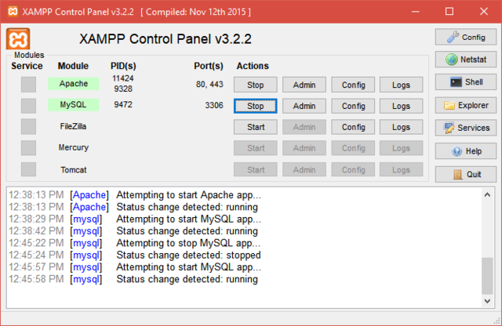
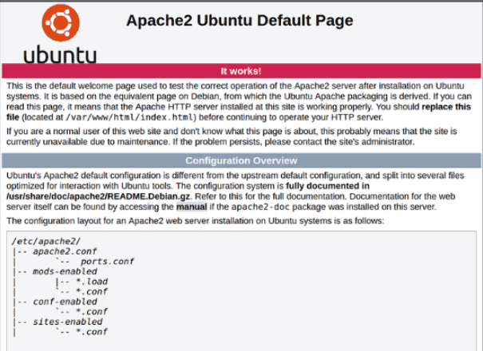

*Utworzony 25.03.2021*

# Serwer www w systemie GNU/Linux

O ile postawienie prostej strony www na XAMPP-ie w Windowsie jest dosyć proste, to konfiguracja serwerów sieciowych w GNU/Linuxie może na początku sprawiać pewne problemy, między innymi dlatego, że zarządza się nimi wyłącznie z poziomu terminala. W dzisiejszym artykule znowu poznacie kilka komend. Opiszę jak krok-po-kroku zainstalować i skonfigurować serwery apache2 i mySQL oraz hosty wirtualne.



Przyjrzyjcie się powyższemu screenshotowi przedstawiającemu panel kontrolny XAMPP-a. Składa się on z kilku modułów-usług, które możemy włączać i wyłączać. Najważniejsze to:

- Apache - Serwer www obsługujący zapytania http dzięki któremu użytkownicy mogą wyświetlać strony w przeglądarce. Działa na porcie 80 dla http i 443 dla https.
- MySQL - Serwer baz danych MySQL z którym łączy się serwer Apache, zapewnia łatwe zarządzanie dużą ilością danych tabelarycznych. W bazach danych przechowuje się dane logowania użytkowników i inne dynamiczne informacje. Działa na porcie 3306.
- FileZilla - Program zarządzający serwerem ftp do przesyłania plików między klientem a serwerem. Protokół ftp działa na portach 20 i 21.

Istnieje także więcej usług sieciowych, na przykład ssh, telnet, dns, czy email. W GNU/Linuxie każda z tych usług jest odrębnym programem. Zaczniemy od instalacji serwera apache2.

## apache2

Program oczywiście zainstalujemy komendą:

```bash
sudo apt install apache2
```

Stan usługi możemy sprawdzić na kilka sposobów. Możemy używać tego, który jest dla nas najwygodniejszy.

```
$ systemctl status apache2
● apache2.service - The Apache HTTP Server
     Loaded: loaded (/lib/systemd/system/apache2.service; enabled; vendor preset: enabled)
     Active: active (running) since Tue 2021-03-23 17:16:23 CET; 1 day 17h ago
       Docs: https://httpd.apache.org/docs/2.4/
    Process: 59398 ExecReload=/usr/sbin/apachectl graceful (code=exited, status=0/SUCCESS)
   Main PID: 954 (apache2)
      Tasks: 11 (limit: 3324)
     Memory: 125.4M
     CGroup: /system.slice/apache2.service
             ├─  954 /usr/sbin/apache2 -k start
             ├─59416 /usr/sbin/apache2 -k start
             ├─59417 /usr/sbin/apache2 -k start
             ├─59418 /usr/sbin/apache2 -k start
             ├─59440 /usr/sbin/apache2 -k start
             ├─59535 /usr/sbin/apache2 -k start
             ├─59579 /usr/sbin/apache2 -k start
             ├─59581 /usr/sbin/apache2 -k start
             ├─59687 /usr/sbin/apache2 -k start
             ├─65378 /usr/sbin/apache2 -k start
             └─65379 /usr/sbin/apache2 -k start

Warning: some journal files were not opened due to insufficient permissions.
```
```
$ /etc/init.d/apache2 status
● apache2.service - The Apache HTTP Server
     Loaded: loaded (/lib/systemd/system/apache2.service; enabled; vendor preset: enabled)
     Active: active (running) since Tue 2021-03-23 17:16:23 CET; 1 day 17h ago
       Docs: https://httpd.apache.org/docs/2.4/
    Process: 59398 ExecReload=/usr/sbin/apachectl graceful (code=exited, status=0/SUCCESS)
   Main PID: 954 (apache2)
      Tasks: 11 (limit: 3324)
     Memory: 124.7M
     CGroup: /system.slice/apache2.service
             ├─  954 /usr/sbin/apache2 -k start
             ├─59416 /usr/sbin/apache2 -k start
             ├─59417 /usr/sbin/apache2 -k start
             ├─59418 /usr/sbin/apache2 -k start
             ├─59440 /usr/sbin/apache2 -k start
             ├─59535 /usr/sbin/apache2 -k start
             ├─59579 /usr/sbin/apache2 -k start
             ├─59581 /usr/sbin/apache2 -k start
             ├─59687 /usr/sbin/apache2 -k start
             ├─65378 /usr/sbin/apache2 -k start
             └─65379 /usr/sbin/apache2 -k start

Warning: some journal files were not opened due to insufficient permissions.
```
```
$ service apache2 status
● apache2.service - The Apache HTTP Server
     Loaded: loaded (/lib/systemd/system/apache2.service; enabled; vendor preset: enabled)
     Active: active (running) since Tue 2021-03-23 17:16:23 CET; 1 day 17h ago
       Docs: https://httpd.apache.org/docs/2.4/
    Process: 59398 ExecReload=/usr/sbin/apachectl graceful (code=exited, status=0/SUCCESS)
   Main PID: 954 (apache2)
      Tasks: 11 (limit: 3324)
     Memory: 123.3M
     CGroup: /system.slice/apache2.service
             ├─  954 /usr/sbin/apache2 -k start
             ├─59416 /usr/sbin/apache2 -k start
             ├─59417 /usr/sbin/apache2 -k start
             ├─59418 /usr/sbin/apache2 -k start
             ├─59440 /usr/sbin/apache2 -k start
             ├─59535 /usr/sbin/apache2 -k start
             ├─59579 /usr/sbin/apache2 -k start
             ├─59581 /usr/sbin/apache2 -k start
             ├─59687 /usr/sbin/apache2 -k start
             ├─65378 /usr/sbin/apache2 -k start
             └─65379 /usr/sbin/apache2 -k start

Warning: some journal files were not opened due to insufficient permissions.
```
```
$ apachectl status
               Apache Server Status for localhost (via 127.0.0.1)

   Server Version: Apache/2.4.41 (Ubuntu) OpenSSL/1.1.1f

   Server MPM: prefork

   Server Built: 2020-08-12T19:46:17

     ----------------------------------------------------------------------

   Current Time: Thursday, 25-Mar-2021 10:50:47 CET

   Restart Time: Tuesday, 23-Mar-2021 17:16:23 CET

   Parent Server Config. Generation: 3

   Parent Server MPM Generation: 2

   Server uptime: 1 day 17 hours 34 minutes 24 seconds

   Server load: 0.81 0.81 0.88

   Total accesses: 1624 - Total Traffic: 2.5 MB - Total Duration: 1768282

   CPU Usage: u210.69 s10.31 cu582.63 cs19.11 - .55% CPU load

   .0109 requests/sec - 17 B/second - 1619 B/request - 1088.84 ms/request

   1 requests currently being processed, 9 idle workers

 ._______W_._....................................................
 ................................................................
 ......................

   Scoreboard Key:
   "_" Waiting for Connection, "S" Starting up, "R" Reading Request,
   "W" Sending Reply, "K" Keepalive (read), "D" DNS Lookup,
   "C" Closing connection, "L" Logging, "G" Gracefully finishing,
   "I" Idle cleanup of worker, "." Open slot with no current process
```

Dla mnie najwygodniejsza jest komenda `systemctl`, ponieważ dla każdej z usług zapewnia taki sam sposób obsługi. Z kolei `apachectl` wyświetla najwięcej szczegółów.

```bash
# sprawdzenie stanu serwera
systemctl status apache2
# uruchomienie serwera
sudo systemctl start apache2
# zatrzymanie serwera
sudo systemctl stop apache2
# restart serwera
sudo systemctl restart apache2
# przeładowanie ustawień - czyli taki szybszy restart
sudo systemctl reload apache2
```

Cóż... musimy się przyzwyczaić, że przy każdym starcie i zatrzymywaniu usługi będziemy podawać hasło. Ale jeżeli zajmujecie się tylko tworzeniem stron, nie będziecie często korzystać z tych komend. Usługi sieciowe uruchomią się automatycznie wraz ze startem Linuxa.

Po zainstalowaniu serwera apache2 możecie wpisać w przeglądarkę adres [localhost](http://localhost) lub [127.0.0.1](http://127.0.0.1). Powinna się wyświetlić taka strona:



Lokalizacja plików www może się różnić w zależności od dystrybucji GNU/Linuxa. W Kubuntu pliki są zlokalizowane w `/var/www/html`. Jeżeli nie możecie znaleźć tego katalogu, sprawdźcie wartość `DocumentRoot` pliku `/etc/apache2/sites-available/000-default.conf`.

```
$ cat /etc/apache2/sites-available/000-default.conf | grep DocumentRoot
        DocumentRoot /var/www/html
```

Modyfikator `grep` wyszukuje w tekście odpowiednią wartość i wyświetla tylko te wartości w których występuje.

Oryginalnie zarówno katalog www, jak i html, należą do użytkownika `root`, dlatego nie możemy modyfikować jego zawartości. Wykonywanie wszystkich operacji jako root byłoby nierozsądne, dlatego przed edycją zmienimy właściciela pliku na własny.

```bash
sudo chown -R ja: /var/www
```

Parametr `-R` zadziała rekursywnie, to znaczy że oprócz samego katalogu wybierze wszystkie pliki znajdujące się w nim.

**To nie koniec artykułu. Resztę napiszę później.**