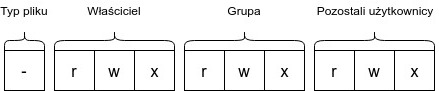

*Utworzony 17.03.2021*

# System plików Linuxa

System plików Linuxa to jedno z najważniejszych zagadnień niezbędnych do opanowania aby sprawnie poruszać się po systemie. I jest trochę bardziej złożone zagadnienie niż mogłoby się wydawać, dlatego postaram się je w miarę jasno wytłumaczyć.

Poniżej znajduje się tabelka z głównymi różnicami między systemem plików Windowsa i Linuxa.

|                                       | Windows      | Linux     |
| ------------------------------------- | ------------ | --------- |
| typowy format partycji                | NTFS         | ext4      |
| węzeł główny                          | nie          | tak       |
| separator katalogów w ścieżce         | \            | /         |
| rozróżnianie wielkości liter w nazwie | nie          | tak       |
| rozpoznawanie typu pliku              | rozszerzenie | zawartość |
| wsparcie wirtualnych systemów plików  | słabe        | dobre     |

## Węzeł główny

W systemie Windows partycje są oznaczone literami: `C:` dla partycji systemowej, oraz kolejne litery dla pozostałych partycji i urządzeń pamięci masowej, które mogły ulegać zmianie. System Linux nie oznacza partycji literami, ponieważ wszystko znajduje się w węźle głównym zwanym *rootfs* (root filesystem), znajdujący się pod ścieżką `/`.  Podczas startu systemu pod tą lokalizacją montowana jest partycja systemowa - ta na której zainstalowaliśmy Linuxa. Pozostałe partycje i dyski mogą być montowane wewnątrz pustych katalogów. Ale czym jest to montowanie?

Po podłączeniu pendriva lub dysku zewnętrznego przykładowa ścieżka do partycji to: `/dev/sdb`. Jest to ścieżka do urządzenia i zarazem identyfikator partycji, tak jak w Windowsie identyfikatorami są kolejne litery, ale pliki będą dostępne z lokalizacji np. `/media/user/label/`, gdzie *user* to nazwa użytkownika, a *label* to etykieta którą możemy nadać urządzeniu, np. "FILMY" lub "PRACA".

W powyższym przykładzie partycja `/dev/sdb` została zamontowana w `/media/user/label/`. Zatem montowanie to operacja polegająca na przypięciu jakiegoś systemu plików wewnątrz drzewa katalogów. Po odłączeniu partycji zostanie ona odmontowana, a pusty katalog usunięty.

Jeżeli nigdy wcześniej nie używaliście systemu GNU/Linux, mogliście mieć pewne problemy z instalacją na etapie partycjonowania, ponieważ partycje były identyfikowane inaczej, na Linuxowy sposób. Poza tym mogliście zauważyć, że oryginalnie znajdowały się tam przynajmniej 3 partycje, choć używając Windowsa widzimy tylko jedną z nich. Mam nadzieję, że instalując GNU/Linuxa obok Windowsa nie usunęliście ich.

## Uprawnienia

W Linuxie każdy plik posiada metadane o ich właścicielu oraz uprawnieniach które nadał sobie i innym użytkownikom. Tylko właściciel pliku może zarządzać uprawnieniami. Istnieją 3 podstawowe typy uprawnień:

- Uprawnienia do odczytu (**r** - read) - określają, czy użytkownik może odczytać zawartość pliku
- Uprawnienia do zapisu (**w** - write) - określają, czy użytkownik może zapisać dane do pliku
- Uprawnienia do wykonania (**x** - execute) - jeżeli dotyczą pliku, określają czy użytkownik może go uruchomić jako program, a jeżeli katalogu, czy może z niego uczynić swój katalog roboczy (np. przechodząc do niego komendą `cd`).

Uprawnienia te występują w 3 grupach: dla właściciela, grupy i innych użytkowników. Plik może należeć do tylko jednej grupy. Uprawnienia zapisywane są w jednej z dwóch form: zapisie literowym, oraz ósemkowym. Osobiście preferuję pierwszy format.



```
$ ls -l /
razem 1519548
drwxr-xr-x   2 root root       4096 mar 10 13:19 bin
drwxr-xr-x   4 root root       4096 mar 16 09:34 boot
drwxr-xr-x   4 root root       4096 lut 24 15:11 boot_bak
drwxr-xr-x   2 root root       4096 wrz 28 18:43 cdrom
drwxr-xr-x  21 root root       4600 mar 17 14:20 dev
drwxr-xr-x 169 root root      12288 mar 16 09:05 etc
drwxr-xr-x   6 root root       4096 gru 30 17:03 home
drwxr-xr-x   3 root root       4096 lis 26 17:30 include
lrwxrwxrwx   1 root root         32 paź 21 09:17 initrd.img -> boot/initrd.img-5.4.0-52-generic
lrwxrwxrwx   1 root root         32 paź 21 09:17 initrd.img.old -> boot/initrd.img-5.4.0-51-generic
drwxr-xr-x  22 root root       4096 lut 26 14:01 lib
drwxr-xr-x   2 root root       4096 sty 27 11:29 lib64
drwx------   2 root root      16384 wrz 28 18:40 lost+found
drwxr-xr-x   6 root root       4096 gru 30 17:23 media
drwxr-xr-x   2 root root       4096 sie  7  2020 mnt
dr-xr-xr-x 317 root root          0 mar 16 08:59 proc
drwx------  21 root root       4096 mar 10 12:09 root
drwxr-xr-x  38 root root       1040 mar 17 06:46 run
drwxr-xr-x   2 root root      12288 mar  3 18:57 sbin
drwxr-xr-x  12 root root       4096 mar 12 11:00 snap
drwxr-xr-x   2 root root       4096 sie  7  2020 srv
-rw-------   1 root root 1555891200 wrz 28 18:40 swapfile
dr-xr-xr-x  13 root root          0 mar 16 08:59 sys
drwxrwxrwt  21 root root      12288 mar 17 16:39 tmp
drwxr-xr-x  21 root root       4096 mar  2 08:19 ubuntu
drwxr-xr-x  11 root root       4096 lis 22 15:11 usr
drwxr-xr-x  15 root root       4096 paź  5 16:52 var
lrwxrwxrwx   1 root root         29 paź 21 09:17 vmlinuz -> boot/vmlinuz-5.4.0-52-generic
lrwxrwxrwx   1 root root         29 paź 21 09:17 vmlinuz.old -> boot/vmlinuz-5.4.0-51-generic
```

Do nadawania uprawnień plikom służy komenda:

```bash
$ chmod permissions node
```

gdzie: node to po prostu nazwa węzła (pliku lub katalogu), a permissions to uprawnienia w formie zapisu ósemkowego lub:

| zapis | znaczenie                                                    |
| ----- | ------------------------------------------------------------ |
| u+rwx | Przyznaje wszystkie uprawnienia właścicielowi (user)         |
| u-rwx | Odbiera wszystkie uprawnienia właścicielowi                  |
| g+rw  | Przyznaje uprawnienia do odczytu i zapisu grupie (group)     |
| o-wx  | Odbiera uprawnienia do zapisu i wykonania pozostałym użytkownikom (others) |

Natomiast do zmiany właściciela służy komenda:

```bash
$ chown user:group node
```

czyli "change owner", gdzie: user to nowy właściciel, a group to nowa grupa. Po zmianie właściciela użytkownik nie będzie mógł już zmieniać uprawnień ani właścicieli.

Oczywiście opcja nadawania uprawnień istnieje także w wielu graficznych menedżerach plików. Mechanizm uprawnień jest jednym z powodów dla których Linux jest bezpieczniejszy od Windowsa.

W literowym zapisie uprawnień można zauważyć jeszcze jeden znak przed pozostałymi. Określa on typ węzła. Dla zwykłych plików jest to **-**, dla katalogów **d**, a dla linków symbolicznych **l**. W systemie Windows mamy tylko 2 typy węzłów - pliki i katalogi. W Linuxie jest ich trochę więcej, ale o nich opowiem kiedy indziej.

## Wszystko jest plikiem

Teraz wróćmy na chwilę do mechanizmu montowania. W Linuxie wszystko jest plikiem, nawet urządzenia dla których istnieją specjalne typy węzłów. Urządzenia znajdują się w katalogu `/dev`. Jeżeli zajrzymy do tego katalogu, zobaczymy znacznie więcej plików niż urządzeń podłączonych do komputera. Dzieje się tak dlatego, że niektórych urządzeń nie widzimy ponieważ znajdują się w jednostce centralnej lub stanowią część płyty głównej, a niektóre są wirtualne. Wirtualne urządzenia to takie, które fizycznie nie istnieją, ale istnieją w systemie i pełnią jakąś rolę. Przykładem takiego urządzenia może być `/dev/urandom` - generator liczb pseudolosowych, albo `/dev/stdin` - wejście terminala. Niektóre urządzenia składają się z kilku plików. Na przykład dysk twardy ma oddzielny plik jako dysk i jako każda z partycji. Z kolei w katalogu `/dev/pts` znajdują się wirtualne urządzenia-sesje terminala. Jeżeli otworzymy terminal, a następnie sprawdzimy zawartość tego katalogu, zaobserwujemy że pojawił się tam nowy plik, a po jego zamknięciu zniknął.

Plikami są także procesy systemu, znajdziemy je w katalogu `/proc` w formie katalogów. Komendą `ps aux` możecie wyświetlić listę uruchomionych procesów systemu. Każdy z tych procesów ma numer PID, a katalogi w `/proc` odpowiadają numerom PID.

W obu przypadkach nie mamy do czynienia z realnymi plikami na dysku, a wirtualnymi systemami plików zamontowanymi w rootfs-ie podobnie jak partycje. Wirtualny system plików to obsługiwany przez jądro interfejs, dostarczający mechanizmy do operowania na plikach i katalogach w jednolity sposób. Opierają się na nim wszystkie systemy plików przechowujące dane na dysku, ale można ich użyć także do tworzenia pseudo-systemów plików - wirtualnych tworów, które tylko "udają" przed programami prawdziwy system plików. Linux eksponuje w formie systemu plików większość interfejsów między jądrem systemu a przestrzenią użytkownika.

Czytanie lub pisanie do pliku wcale nie musi być związane z zapisem danych. Spowoduje jedynie wywołanie odpowiedniej funkcji jądra, odpowiedzialnej za obsługę danej operacji na takim wirtualnym pliku. W rzeczywistości operacje na "zwykłych" plikach także je wywołują, tyle że są dla nas niewidoczne pod płaszczem wirtualnego systemu plików.

I to by było na tyle, jeśli chodzi o system plików Linuxa. To był artykuł teoretyczny, a wkrótce planuję napisać na temat konfiguracji pamięci wymiany (swap).