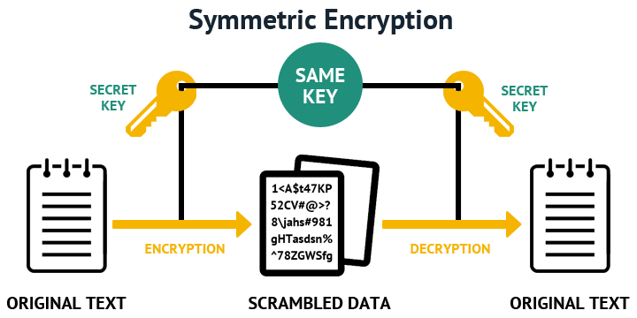

*Utworzony 21.05.2021*

# Szyfrowanie emaili

Dla większości z nas poczta email to taki krytyczny węzeł w tworzonej przez nas mikrosieci połączonych ze sobą kont internetowych, ponieważ za jego pomocą większość serwisów, sklepów i usług oferuje resetowanie hasła i potwierdzanie tożsamości. Poza tym często przesyłamy nim różne poufne informacje. Katastrofą byłoby przejęcie naszego konta email, bo wtedy atakujący mógłby zalogować się do innych stron w których jesteśmy zarejestrowani na ten adres, podszywać się pod nas i wyrządzić duże szkody. Dostawcy email, jak Gmail, Onet, WP czy Outlook też mogą czytać wasze maile bez waszej wiedzy i zgody (i prawdopodobnie to robią). W dzisiejszym artykule, jak zapowiedziałem, opowiem o szyfrowaniu wiadomości, tak że nikt poza odbiorcą nie będzie w stanie jej odczytać.

Nie ochroni was to przed włamaniem się na inne konta, bo serwisy internetowe nie szyfrują nawet krytycznych dla bezpieczeństwa maili, ale będziecie mogli w 100% prywatnie komunikować się ze swoimi znajomymi.

## Jak działa szyfrowanie end-to-end?

Zanim zaczniemy, wypadałoby wiedzieć na czym polega szyfrowanie. Przeciętny użytkownik internetu nie wie zbyt wiele o szyfrowaniu. To jest ta dziedzina informatyki owiana tajemnicą, dzięki której możemy przekształcić jawny tekst w wyglądające na całkowicie losowe znaki, i z powrotem. Ich skuteczność nie polega na tajności - tak naprawdę wszystkie algorytmy szyfrowania są jawne (jeżeli ktoś jest ciekawy, może zobaczyć w Wikipedii), a na trudnych do odwrócenia równaniach matematycznych (na przykład mnożenie i rozkład na czynniki pierwsze) z użyciem liczb na tyle dużych, aby współczesne komputery nie potrafiły sobie poradzić z obliczeniem działania odwrotnego w realnym czasie.

Ponieważ technologia ciągle idzie do przodu, a komputery są coraz wydajniejsze, wciąż muszą być projektowane nowe algorytmy, które będą wyprzedzać dostępną moc obliczeniową. Przykładowo RSA, algorytm kryptografii asymetrycznej jest obecnie wypierany przez ed25519.

### Kryptografia symetryczna

Jeśli szyfrowaliście kiedyś dokument lub archiwum zip, wiecie że do zaszyfrowania i odszyfrowania potrzebne jest hasło. Bez hasła nie da się zaszyfrować pliku, bo nie istnieje szyfrowanie niewymagające dodatkowych danych.



Dopóki nie wymyślono kryptografii asymetrycznej, hasło do pliku trzeba było jakoś przesłać do drugiej osoby. Oczywiście przesłanie go razem z plikiem jest bardzo nierozsądnym pomysłem. W takich warunkach klucz przesyłano innym kanałem komunikacji, który można dodatkowo zaszyfrować za pomocą innego klucza i przesłać go jeszcze innym kanałem. Wydłużając taki łańcuch kluczy ryzyko ujawnienia danych w pliku coraz bardziej zbliża się do zera, ale nigdy go nie osiąga, ponieważ ta metoda nie rozwiązuje problemu jakim jest przesyłanie niezaszyfrowanego klucza, a jedynie sprawia, że potencjalny napastnik musi mieć dostęp do wszystkich kanałów komunikacji tych użytkowników.

W takiej sytuacji najbezpieczniej było nie przesyłać klucza w ogóle, a zamiast tego przekazać go ustnie lub na papierze, ale to nie zawsze było możliwe. Problem zniknął dopiero gdy wymyślono kryptografię asymetryczną, w której innego klucza używa się do szyfrowania i deszyfrowania wiadomości.

### Kryptografia asymetryczna


Odbiorca generuje parę kluczy asymetrycznych. Klucze te są losowe i różnią się od siebie, ale połączone ze sobą "magiczną" matematyczną więzią. Jednocześnie nie można obliczyć jednego klucza na podstawie drugiego. Następnie odbiorca udostępnia nadawcy jeden z tych kluczy, zwany kluczem publicznym. Drugi klucz - klucz prywatny - nie powinien nigdy opuścić jego urządzenia.

Nadawca szyfruje wiadomość za pomocą klucza publicznego odbiorcy, przesyła, a odbiorca odszyfrowuje ją swoim kluczem prywatnym. Jeżeli chciałby na tą wiadomość odpowiedzieć, nadawca (który staje się teraz odbiorcą) także musiałby wygenerować sobie parę kluczy.

### Podpisywanie cyfrowe

Kryptografia asymetryczna dzięki swej budowie ma podwójną naturę. Jeżeli zastosujemy operację odwrotną do opisanej powyżej, czyli zaszyfrowanie wiadomości swoim kluczem prywatnym zamiast kluczem publicznym odbiorcy, będzie ona możliwa do odszyfrowania przez każdego, ale nikt nie będzie mógł zaprzeczyć, że to właśnie my jesteśmy autorami dokumentu, ponieważ da się go odszyfrować tylko naszym kluczem. Najczęściej nie podpisuje się całego dokumentu, tylko jego sumę kontrolną.

Suma kontrolna to jednokierunkowa funkcja kryptograficzna obliczająca z długiego dokumentu krótki hash. Ma on pewną szczególną właściwość, że najdrobniejsza zmiana powoduje efekt lawiny, zupełnie zmieniając wygenerowany hash.

```php
md5("Suma kontrolna to jednokierunkowa funkcja kryptograficzna obliczająca z długiego dokumentu krótki hash."); //70ed7ec0a9f7b877b2dfbe7fb4889c34
md5("Suma kontrolna to jednokierunkowa funkcja kryptograficzna wyliczająca z długiego dokumentu krótki hash."); //631dcf26d1939f5e65b88203c8c2157f 
```

Mogą istnieć 2 różne dokumenty dające tę samą sumę kontrolną, ponieważ dokument może być dowolnie długi a suma kontrolna jest zawsze tej samej długości. Funkcja hashująca, jak każdy inny algorytm kryptograficzny, powinien być zaprojektowany tak, aby trudno było znaleźć dokumenty do których należy hash. Funkcja `md5` jest powszechnie uważana za niebezpieczną i zaleca się używanie `sha256`.

### Szyfrowanie end-to-end

Szyfrowanie i podpisywanie można ze sobą połączyć: wtedy komunikacja będzie bezpieczniejsza, ponieważ nikt nie będzie mógł się pod nas podszyć.


Wyjaśnijmy krok-po-kroku, co się tu dzieje:

1. Nadawca przygotowuje dokument
2. Nadawca oblicza sumę kontrolną
3. Nadawca szyfruje hash swoim kluczem prywatnym - powstaje podpis cyfrowy dokumentu, oznaczony na rysunku jako czerwona szkatułka
4. Dokument razem z podpisem jest szyfrowany za pomocą klucza publicznego odbiorcy - powstaje pakiet który może zostać bezpiecznie przesłany przez sieć
5. Odbiorca otrzymawszy pakiet, odszyfrowuje go swoim kluczem prywatnym
6. Odbiorca odszyfrowuje sumę kontrolną kluczem publicznym nadawcy
7. Odbiorca sam oblicza sumę kontrolną wiadomości
8. Odbiorca porównuje otrzymaną sumę kontrolną z sumą którą sam obliczył

Szyfrowanie end-to-end często także łączy w sobie kryptografię asymetryczną i symetryczną. W takim wypadku nadawca przesyłałby w zielonej szkatułce klucz symetryczny do zawierającej wiadomość niebieskiej która trzymana byłaby na zewnątrz - i dokładnie tak dzieje się w wiadomościach email: cała wiadomość szyfrowana jest symetrycznie za pomocą losowego hasła, które z kolei szyfrowane jest za pomocą klucza publicznego odbiorcy. Jeżeli wiadomość ma kilku odbiorców, dla każdego z nich hasło jest zaszyfrowane oddzielnie. Ma to kilka zalet:

- Szyfrowanie emaila trwa szybciej, bo kryptografia asymetryczna jest dużo wolniejsza od symetrycznej
- Jeżeli email jest wysyłany do wielu odbiorców, tylko nieznacznie zwiększa swój rozmiar
- Nie obniża to bezpieczeństwa emaila, bo hasło nigdy nie jest przesyłane w postaci niezaszyfrowanej, a łamanie danych zaszyfrowanych symetrycznie z użyciem brute-force trwa dłużej. Atakujący będzie próbował złamać najsłabsze ogniwo, czyli szyfrogram hasła.

Wiecie już wystarczająco dużo o szyfrowaniu end-to-end aby przejść do praktyki.

## Instalacja i konfiguracja Thunderbird

Jeżeli do tej pory odbieraliście pocztę przez stronę internetową, niestety będziecie musieli zmienić swoje przyzwyczajenia i używać do poczty specjalnego programu zwanego klientem poczty. Na niektórych dystrybucjach GNU/Linuxa Thunderbird jest preinstalowany, ale jeżeli u was nie jest, możecie go zainstalować komendą:

```bash
sudo apt install thunderbird
```

Po uruchomieniu program powinien poprowadzić nas krok-po-kroku w celu skonfigurowania konta email.


I teraz uwaga - **nie wszyscy dostawcy poczty wspierają standardowe protokoły** email jak IMAP, POP3 i SMTP, mimo że kiedyś był to główny sposób interakcji z pocztą elektroniczną. Nie wynika to z ich przestarzałości, ponieważ protokoły te wciąż są używane, ale ja to postrzegam jako ograniczanie wolności użytkownika, który nie musi chcieć przeglądać poczty przy użyciu strony internetowej i oficjalnej aplikacji. Niektóre serwisy robią to "ze względów bezpieczeństwa", ale w takim wypadku IMAP powinien być domyślnie wyłączony, ale mieć możliwość włączenia przez użytkownika. Jeszcze inne serwisy wymagają, aby zamiast hasła wpisać specjalny token. Informacje na ten temat powinny być dostępne na stronie danej usługi.

Jeśli chodzi o Gmaila, to powinniście bez problemu się zalogować. W bazie jest dostępna automatyczna konfiguracja i uwierzytelnianie przez OAuth - w ogóle nie musicie wpisywać hasła do Google w polu "password", wystarczy wpisać sam adres email. Z tego co wiem, korzystanie z klienta poczty nie jest możliwe przy iCloud oraz Tutanota, ale sprawdźcie sami bo może coś się zmieniło odkąd napisałem ten artykuł.

Jeżeli uda wam się poprawnie zalogować, powinniście zobaczyć po lewej stronie swoje foldery: "odebrane", "wysłane", "kosz", "spam", etc.

## Co to jest OpenPGP?

Alicja[^1] chce wysłać wiadomość do Boba. Odnajduje w internecie jego klucz publiczny, szyfruje nim wiadomość i wysyła. Mallory, która podszywała się pod Boba odszyfrowuje wiadomość swoim kluczem prywatnym, szyfruje ją prawdziwym kluczem publicznym Boba i przekazuje do niego wiadomość Alicji. Taki rodzaj ataku nazywa się *man-in-the-middle*, i pozwala on napastnikowi nie tylko na odszyfrowanie komunikacji end-to-end, ale także modyfikowanie jej zawartości, nawet jeżeli zastosowane zostanie podpisywanie cyfrowe.

Problemem jest tutaj to, że Alicja nie ma jak sprawdzić, czy klucz który pobrała naprawdę pochodzi od Boba. Nie jest w stanie zweryfikować jego tożsamości. Klucz publiczny można bezpiecznie przesłać przez sieć, ale ktoś sprytny może go podmienić na własny i w ten sposób zainicjować fałszywe połączenie. Klucz publiczny powinno się przesyłać innym kanałem komunikacji niż email, lub po przesłaniu zadzwonić do tej osoby i ustalić z nią czy otrzymany i wysłany klucz jest poprawny. Oczywiście najbezpieczniej byłoby spotkać się w realu i sprawdzić czy otrzymany i wysłany klucz są takie same. Czy nie przypomina wam to sytuacji, gdy trzeba było spotkać się aby przekazać hasło?

Może się wam teraz wydawać, że kryptografia asymetryczna tak naprawdę wcale nie rozwiązała problemu, a jedynie sprawiła, że protokoły sieciowe stały się bardziej zawiłe. Ale jednocześnie dzięki kryptografii asymetrycznej możemy rozwiązać ten problem w inny sposób: ktoś inny może podpisać dokument, w którym poświadcza, że "osobiście zweryfikował, że ten klucz publiczny należy do tej osoby". Wymaga to zaufania do podmiotu podpisującego.

OpenPGP i X.509 to dwa popularne standardy podpisywania kluczy, przedstawiające dwa różne systemy polityczne. Każdy z tych standardów ma ten sam cel, jednak realizują go w inny sposób, i najczęściej są stosowane w innych sytuacjach.

X.509 to system hierarchiczny składający się z urzędów certyfikacji (CA) podpisujących certyfikaty zwykłych użytkowników, czyli dokumenty zawierające klucz publiczny i zadeklarowaną tożsamość. Certyfikaty urzędów certyfikacji są podpisywane przez urzędy wyższego rzędu, a te z kolei przez jeden najważniejszy urząd. Jest to jednocześnie najsłabszy punkt całej struktury, ponieważ potwierdzenie jego tożsamości jest niemożliwe. To dlatego certyfikaty najwyższych urzędów zawsze są domyślnie zapisane w programach do obsługi SSL, najczęściej wbudowanych w system operacyjny.


OpenPGP jest systemem, który całkowicie unika centralnych urzędów certyfikacji. Swoją strukturą przypomina sieć P2P. Odpowiedzialność za potwierdzenie tożsamości użytkownika spoczywa na innych użytkownikach. Każdy użytkownik może podpisywać certyfikaty innych, ale nie oznacza to że podpis każdego będzie równie ważny[^2].

Podpisy użytkowników są dołączane do certyfikatu danej osoby, oraz do certyfikatu osoby podpisującej. Aby ułatwić całą procedurę, certyfikaty są przechowywane na centralnym serwerze kluczy [keys.openpgp.org](https://keys.openpgp.org). Nie zagraża to w żaden sposób systemowi, ponieważ istnieje kilka serwerów lustrzanych, które synchronizują się między sobą, więc nawet jeżeli jeden z nich przestanie działać, nadal będzie można korzystać z pozostałych.


Jak widzicie, kwestia certyfikowania nie jest jeszcze w pełni ustandaryzowana ponieważ różni ludzie mają różne opinie na temat tego jak powinno wyglądać społeczeństwo i internet. Sieci P2P są względnie nowym wynalazkiem i mimo że przewyższają klasyczny scentralizowany model sieci pod względem bezpieczeństwa i niezawodności, wciąż jeszcze są podatne na manipulacje (ataki na sieć P2P działają inaczej niż na pojedynczy serwer). Większość z nas nie musi się przejmować kwestią zaufania do certyfikatów o ile sam je zweryfikuje, ponieważ system potwierdzania tożsamości, oraz samego szyfrowania są od siebie niezależne.

## Generowanie klucza OpenPGP

W starszych wersjach Thunderbirda do wdrożenia OpenPGP konieczne było doinstalowanie wtyczki Enigmail. Obecnie jest to wbudowana funkcjonalność programu. Przejdźcie do ustawień konta (*Accounts Settings /* \<twoje konto email> */ End-to-End Encryption*), otwórzcie *OpenPGP Key Manager*, a następnie *Generate / New Key Pair*. Tożsamość dla certyfikatu powinna się wygenerować automatycznie na danych które wpisaliście podczas logowania na konto email. Jeżeli już wcześniej wygenerowaliście klucz w innym programie jak GnuPG, zaimportujcie go.

Zwróćcie szczególną uwagę na ustawiony typ klucza. Jak wspomniałem na początku, algorytm RSA jest obecnie wypierany przez ed25519 i jest uważany za bezpieczniejszy mimo krótszego generowanego klucza ze względu na specyfikę algorytmu. W Thunderbirdzie jest on opisany jako krzywa eliptyczna.


Zanim będzie można używać tego klucza, należy zmienić kilka ustawień. Wróćcie do ustawień konta email. Zaznaczcie swój klucz w sekcji OpenPGP oraz opcję "Add my digital signature by default" aby domyślnie podpisywać każdą wysłaną wiadomość. Dzięki temu każdemu odbiorcy udostępnicie automatycznie swój klucz publiczny, umożliwiając mu rozpoczęcie prywatnej konwersacji.

## Zabezpieczenie klucza prywatnego

Uwaga, to bardzo ważny etap. Wasz klucz prywatny jest teraz na waszym komputerze przechowywany w formie niezaszyfrowanej. Chronią go tylko uprawnienia dostępu do pliku. Ktokolwiek uzyska dostęp do waszego komputera lub dysku, będzie mógł ukraść wasz klucz. Nawet jeżeli już szyfrujecie swój dysk lub katalog domowy, istnieje pewne ryzyko że jakieś złośliwe oprogramowanie wyśle klucz prywatny do internetu, na skutek czego osoba dysponująca kluczem będzie mogła podszywać się pod was lub odszyfrować wasze maile.

Najważniejszym krokiem jest ustawienie hasła głównego, które zaszyfruje wasze klucze i dane logowania. Przejdźcie do: *Preferences / Privacy & Security*. Zaznaczcie pole "Use a master password" i ustawcie hasło.

Aby dodatkowo zwiększyć poziom bezpieczeństwa, można ustawić datę ważności klucza i gdy wygaśnie wygenerować nowy. Dzięki temu jeżeli wasz klucz wycieknie, osoba która go posiada nie będzie mogła odszyfrować całej historii twoich wiadomości, a tylko te z okresu użytkowania klucza.

### A co jeśli mój klucz prywatny wycieknie?

Musisz natychmiast wszystkich powiadomić o tym zdarzeniu, aby nie ufali już podpisanym tym kluczem wiadomościom. Właściwie powinieneś to zrobić także wtedy, gdy istnieje ryzyko, że ktoś mógł przejąć twój klucz (np. dałeś komuś komputer do naprawienia i nie zabezpieczyłeś swojego klucza). W OpenPGP istnieje w tym celu specjalny mechanizm zwany certyfikatem unieważnienia.

Otwórz menedżer kluczy OpenPGP i z menu kontekstowego klucza wybierz "Revoke Key". Potem utwórz swój nowy klucz i podpisz nim wiadomość email do wszystkich z informacją, że twój klucz prywatny został skompromitowany i nie należy go więcej używać. Thunderbird powinien automatycznie do podpisu dołączyć certyfikat unieważnienia. Pamiętaj, że w tym momencie nikt nie może mieć pewności, czy twój nowy klucz faktycznie należy do ciebie. Atakujący mógł sam utworzyć nową parę kluczy, włamać się na twoje konto i użyć twojego klucza do podpisania tej wiadomości.

Jeżeli wcześniej opublikowałeś swój klucz na serwerze kluczy, wyeksportuj stary klucz zawierający teraz certyfikat unieważnienia i ponownie go opublikuj.

## Wymiana kluczy

Musicie mieć klucz publiczny każdej osoby do której zamierzacie wysyłać zaszyfrowane wiadomości. Oni z kolei będą potrzebować waszego aby na nie odpowiedzieć. Istnieje kilka sposobów udostępnienia komuś swojego klucza publicznego. Najprostszym z nich jest wysyłacie komuś podpisanego emaila: wasz klucz publiczny zostanie załączony do wiadomości, który będzie można potem zaimportować do menedżera kluczy OpenPGP.


Możecie też wyeksportować swój klucz i przekazać go w dowolny sposób: SMS-em, komunikatorem internetowym, na pendrivie, przez ftp... Wyeksportowany klucz możecie także opublikować na serwerze kluczy. W tym celu przejdźcie do strony [keys.openpgp.org](https://keys.openpgp.org/upload), wyślijcie klucz, a następnie kliknijcie w link który otrzymacie w wiadomości email aby potwierdzić, że wyrażacie zgodę na wyszukiwanie waszego klucza z użyciem adresu email. Według mnie serwer powinien jeszcze sprawdzać czy adres email faktycznie należy do właściciela klucza np. przesyłając w tej wiadomości losowy token zaszyfrowany kluczem publicznym, a następnie po kliknięciu w link żądać jego wpisania.

## Szyfruj WSZYSTKO

Słowo na koniec. Wiecie już jak korzystać z OpenPGP w celu szyfrowania poczty. Jest to jeden ze sposobów stawiania oporu masowej inwigilacji. Jednak jeżeli będziecie szyfrować tylko niektóre wiadomości, to dla tych którzy je czytają a nie są odbiorcami będą taką czerwoną flagą, znakiem ostrzegawczym mówiącym, że coś jest nie tak. Ale jeżeli będziecie szyfrować wszystko co się da, po prostu uznają że zaczęliście dbać o swoją prywatność.

Mam do was prośbę: zacznijcie korzystać z Thunderbirda lub innego wolnego klienta poczty obsługującego OpenPGP, wygenerujcie swój klucz i udostępnijcie go wszystkim z którymi macie kontakt zapraszając, aby zrobili to samo i zaczęli szyfrować wysyłane emaile. Pewnie większość z nich nie będzie wiedziała co z tym kluczem zrobić, dlatego wyślijcie też link do [tego](szyfrowanie-emaili.md) lub podobnego artykułu wprowadzającego do szyfrowania poczty przez OpenPGP.

Pozdrawiam was i życzę miłego dnia.

[^1]: Imiona tych fikcyjnych postaci są [powszechnie stosowane](https://en.wikipedia.org/wiki/Alice_and_Bob) w przedstawianiu kryptosystemów i protokołów sieciowych.

[^2]: Dobrze zaprojektowana sieć zaufania powinna zostać zaprojektowana tak, aby zapobiegać atakowi polegającemu na utworzeniu wielu fałszywych tożsamości w celu podpisania jednego certyfikatu

